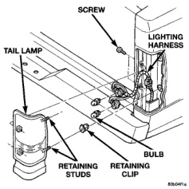

# REMOVAL AND INSTALLATION (Continued)

### PARK AND TURN SIGNAL LAMP

#### REMOVAL

(1) Remove park and turn signal lamp.

(2) Rotate bulb socket 1/4 turn counterclockwise and pull turn signal lamp socket from back of lamp.

(3) Pull park and turn signal lamp bulb from socket.

#### INSTALLATION

(1) Install park and turn signal lamp bulb in socket.

(2) Install park and turn signal lamp socket into back of lamp.

(3) Install park/turn signal lamp.

### ROOF CLEARANCE LAMP BULB

For bulb replacement refer roof clearance lamp removal/installation procedure.

### CENTER HIGH MOUNTED STOP LAMP (CHMSL) BULB

#### REMOVAL

(1) Remove the CHMSL from the roof panel.

(2) Rotate sockets 1/4 turn clockwise and remove from lamp. (The center bulbs light the stoplamp and the outside bulbs light the cargo lamp.)

(3) Pull bulb from socket.

#### INSTALLATION

(1) Push bulb into socket.

(2) Position socket in lamp and rotate socket 1/4 turn counterclockwise.

(3) Install the CHMSL.

### CARGO LAMP BULB

The cargo lamp bulb is incorporated in the CHMSL assembly, refer to the CHMSL bulb removal and installation procedure for bulb replacement.

### SIDE IDENTIFICATION (ID) LAMP BULBS

The bulbs in the side ID lamps can not be replaced. If a bulb should fail, the entire lamp would require replacement. Refer to the Side Identification Lamp Removal/Installation procedure in this group.

### TAIL, STOP, TURN SIGNAL AND BACK-UP LAMP BULB—PICKUP

#### REMOVAL

(1) Remove screws from tail lamp (Fig. 3).

(2) Grasp lamp, firmly pull lamp rearward to disengage retaining studs.

(3) Remove socket from tail lamp.

(4) Separate tail lamp from cargo box.

(5) Pull bulb from socket.

#### INSTALLATION

(1) Install bulb in socket.

(2) Install socket in tail lamp.

(3) Position tail lamp in cargo box, engage retaining studs and install screws (Fig. 3).

*Fig. 3 Tail, Stop, Turn Signal and Back-up Lamp Bulb*

---
*8L Lamps - Page 8*
