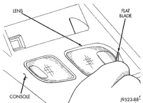

# REMOVAL AND INSTALLATION (Continued)

### TAIL, STOP, TURN SIGNAL AND BACK-UP LAMP BULB—CAB CHASSIS

#### REMOVAL

(1) Remove screws holding tail lamp lens to lamp body.

(2) Separate lens from lamp.

(3) Grasp bulb, push in slightly and rotate 1/2 turn counter-clockwise.

#### INSTALLATION

(1) Install bulb in socket.

(2) Install lamp lens.

### REAR IDENTIFICATION (ID) LAMP BULBS

The bulbs in the rear ID lamps can not be replaced. If a bulb should fail, the entire lamp would require replacement.

### LICENSE PLATE LAMP BULB

#### REMOVAL

(1) Remove license plate lamp lens.

(2) Pull bulb from license plate lamp.

#### INSTALLATION

(1) Install bulb in license plate lamp.

(2) Install license plate lamp lens.

### UNDERHOOD LAMP BULB

#### REMOVAL

(1) Disconnect the wire harness connector from the underhood lamp.

(2) Rotate the bulb counterclock-wise. Remove it from the lamp socket.

#### INSTALLATION

(1) Insert the replacement bulb in the lamp base socket. Rotate it clockwise.

(2) Connect the wire harness connector to the lamp.

### DOME LAMP BULB

#### REMOVAL

(1) Remove dome lamp lens.

(2) Pull bulb from lamp.

#### INSTALLATION

(1) Install bulb in lamp.

(2) Position lens on lamp and snap into place.

### OVERHEAD CONSOLE READING LAMP BULB

#### REMOVAL

(1) Insert a flat blade screwdriver in slot at front of lens (Fig. 4).

(2) Rotate the screwdriver until lens snaps out of the housing.

(3) Remove lens from housing.

(4) Remove bulb from terminals.

#### INSTALLATION

(1) Insert bulb into reading lamp terminals.

(2) Replace lens by holding lens level and pushing rearward into housing.

(3) Push lens up to snap into housing.

*Fig. 4 Overhead Console Reading Lamp Bulb Removal*

---
*8L Lamps - Page 9*
