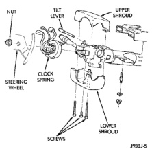

# REMOVAL AND INSTALLATION (Continued)

(5) Remove the two nuts that secure the support bracket to the studs on the lower instrument panel.

(6) Disengage the wire harness retainer from the hole in the support bracket.

(7) Pull the top of the support bracket away from the instrument panel studs and fold it down over the airbag control module until it is laying on the floor panel.

(8) Unplug the wire harness connector from the airbag control module.

**NOTE: Always remove and replace the airbag control module and its mounting bracket as a unit. Replacement modules include a replacement mounting bracket. Do not transfer the module to another mounting bracket.**

(9) Remove the four screws that secure the mounting bracket to the floor panel transmission tunnel.

(10) Remove the airbag control module, the mounting bracket and the support bracket as a unit from the floor panel.

(11) When installing the airbag control module, position the unit with the arrow on the module housing pointing forward.

(12) Attach the ACM to the floor panel transmission tunnel with the four mounting screws.

(13) Reverse the removal procedures to install. Before installing the trim cover or the floor console, be certain that the airbag control module wire harness connector latches are fully engaged and that the connector lock is pushed in. Tighten the mounting hardware as follows:

- Mounting bracket screws - 14 N·m (125 in. lbs.)
- Support bracket nuts - 14 N·m (125 in. lbs.)
- Trim cover screws - 2.2 N·m (20 in. lbs.)

(14) Do not connect the battery negative cable at this time. See Airbag System in the Diagnosis and Testing section of this group for the proper procedures.

## CLOCKSPRING

**WARNING: THE AIRBAG SYSTEM IS A SENSITIVE, COMPLEX ELECTROMECHANICAL UNIT. BEFORE ATTEMPTING TO DIAGNOSE OR SERVICE ANY AIRBAG SYSTEM OR RELATED STEERING WHEEL, STEERING COLUMN, OR INSTRUMENT PANEL COMPONENTS YOU MUST FIRST DISCONNECT AND ISOLATE THE BATTERY NEGATIVE (GROUND) CABLE. THEN WAIT TWO MINUTES FOR THE SYSTEM CAPACITOR TO DISCHARGE BEFORE FURTHER SYSTEM SERVICE. THIS IS THE ONLY SURE WAY TO DISABLE THE AIRBAG SYSTEM. FAILURE TO DO THIS COULD RESULT IN ACCIDENTAL AIRBAG DEPLOYMENT AND POSSIBLE PERSONAL INJURY.**

(1) Turn the steering wheel until the front wheels are in the straight-ahead position before starting the procedure.

(2) Disconnect and isolate the battery negative cable. If the airbag has not been deployed, wait two minutes for the system capacitor to discharge before further service.

(3) Remove the driver side airbag module from the steering wheel. See Airbag Module in the Removal and Installation section of this group for the procedures.

(4) If the vehicle is equipped with the optional vehicle speed control, unplug the wire harness connectors from the speed control switches in the steering wheel.

(5) Remove the nut that secures the steering wheel to the steering column upper shaft.

(6) Remove the steering wheel with a steering wheel puller (Special Tool C-3428-B).

(7) Remove the steering column opening cover and knee blocker from the instrument panel. Refer to Steering Column Opening Cover and Knee Blocker in the Removal and Installation section of Group 8E - Instrument Panel Systems for the procedures.

(8) If the vehicle is so equipped, remove the tilt steering column lever.

(9) Remove both the upper and lower shrouds from the steering column (Fig. 13).

*Fig. 13 Steering Column Shrouds Remove/Install - Typical*

(10) Remove the lower fixed column shroud from the steering column.

(11) Unplug the wire harness connectors from the clockspring.

---
*8M Passive Restraint Systems - Page 10*
