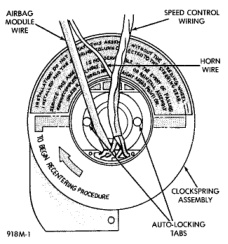

# ADJUSTMENTS (Continued)

*Fig. 14 Clockspring Auto-Locking Tabs*

The clockspring horn wire harness should end up at the top, and the airbag wire harness and optional speed control switch wire harnesses at the bottom.

(10) The front wheels should still be in the straight-ahead position. Install the steering wheel being certain to index the flats on the hub of the steering wheel with the formations on the inside of the clockspring. Pull the wire harnesses from the clockspring through the upper and lower holes between the steering wheel back trim cover and the steering wheel armature. Tighten the steering wheel nut to 61 N·m (45 ft. lbs.). Be certain not to pinch the wiring between the steering wheel and the nut.

(11) If the vehicle is so equipped, plug in the wire harness connectors to the vehicle speed control switches. Be certain that the speed control switch wire harnesses are routed between the steering wheel back trim cover and the steering wheel armature.

(12) Install the driver side airbag module onto the steering wheel. See Airbag Module in the Removal and Installation section of this group for the procedures.

# SPECIAL TOOLS

## STEERING WHEEL

*Fig. 2*

*Puller C-3428-B*

---
*8M Passive Restraint Systems - Page 12*
