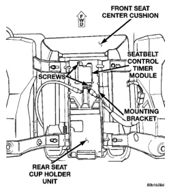

# REMOVAL AND INSTALLATION

## SEATBELT TIMER CONTROL MODULE

(1) Disconnect and isolate the battery negative cable.

(2) Remove the fasteners that secure the front seat adjusters to the floor panel. Refer to Group 23 - Body for the procedures.

(3) Tilt the seat back and reach under the forward edge of the front seat center cushion to remove the two screws that secure the seatbelt timer control module to the mounting bracket (Fig. 1).

(4) Lower the seatbelt control timer module from the mounting bracket far enough to access and unplug the wire harness connector.

(5) Remove the seatbelt control timer module from under the front seat.

(6) Reverse the removal procedures to install. Tighten the mounting screws to 2.2 N·m (20 in. lbs.).

(7) Do not connect the battery negative cable at this time. See Seatbelt Control System Test Mode in the Diagnosis and Testing section of this group for the proper procedures.

*Fig. 1 Seatbelt Timer Control Module Remove/Install*

---
*8M Passive Restraint Systems - Page 17*
