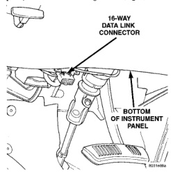

# DIAGNOSIS AND TESTING

### AIRBAG SYSTEM

A DRB scan tool is required for diagnosis of the airbag system. Refer to the proper Diagnostic Procedures manual for more information.

(1) Connect the DRB scan tool to the 16-way data link wire harness connector. The connector is located on the driver side lower edge of the instrument panel, inboard of the steering column (Fig. 1).

*Fig. 1 16-Way Data Link Connector - Typical*

(2) Turn the ignition switch to the On position. Exit the vehicle with the DRB. Use the latest version of the proper DRB cartridge.

(3) Using the DRB, read and record the active Diagnostic Trouble Code (DTC) data.

(4) Read and record any stored DTC data.

(5) Refer to the proper Diagnostic Procedures manual if any DTC is found in Step 3 or Step 4.

(6) Erase the stored DTC data. If any problems remain, the stored DTC data will not erase.

(7) With the ignition switch still in the On position, make sure nobody is in the vehicle.

(8) From outside of the vehicle (away from the airbag modules in case of an accidental deployment) turn the ignition switch to the Off position for about ten seconds, and then back to the On position. Observe the airbag indicator lamp in the instrument cluster. It should light for six to eight seconds, and then go out. This indicates that the airbag system is functioning normally.

**NOTE: If the airbag indicator lamp fails to light, or lights and stays on, there is an airbag system malfunction. Refer to the proper Diagnostic Procedures manual to diagnose the problem.**

**NOTE: All extended cab models (club cab or quad cab) are equipped with a structural seat, which uses an electronic structural seat belt control system to control the latching and unlatching of the integral seat belt retractors. The structural seat belt control system MUST be tested to ensure proper operation following the service of any airbag system component. See Seat Belt Control System Test Mode in the Seat Belt Control Systems section of this group for the test procedure.**

# SERVICE PROCEDURES

### AIRBAG SYSTEM

At no time should any source of electricity be permitted near the inflator on the back of an airbag module. When carrying a non-deployed airbag module, the trim cover or airbag side of the module should be pointed away from the body to minimize injury in the event of an accidental deployment. If the module is placed on a bench or any other surface, the trim cover or airbag side of the module should be face up to minimize movement in the event of an accidental deployment.

In addition, the airbag system should be disarmed whenever any steering wheel, steering column, or instrument panel components require diagnosis or service. Failure to observe this warning could result in accidental airbag deployment and possible personal injury. Refer to Group 8E - Instrument Panel Systems for additional service procedures on the instrument panel. Refer to Group 19 - Steering for additional service procedures on the steering wheel and steering column.

Any vehicle which is to be returned to use after an airbag deployment, must have both airbag modules, the clockspring, and the steering column assembly replaced. These components will be damaged or weakened as a result of an airbag deployment, which may or may not be obvious during a visual inspection, and are not intended for reuse.

Other vehicle components should be closely inspected, but are to be replaced only as required by the extent of the visible damage incurred.

---
*8M Passive Restraint Systems - Page 4*
