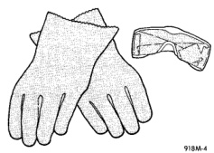
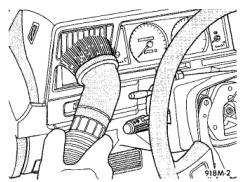

# SERVICE PROCEDURES (Continued)

## CLEANUP PROCEDURE

Following an airbag system deployment, the vehicle interior may contain a powdery residue. This residue consists of harmless particulate by-products of the small pyrotechnic charge used to initiate the airbag deployment. However, this residue may cause irritation to the skin, eyes, nose, or throat, be sure to wear safety glasses, rubber gloves, and a long-sleeved shirt during cleanup (Fig. 2).

*Fig. 2 Wear Safety Glasses and Rubber Gloves*

**WARNING: IF YOU EXPERIENCE SKIN IRRITATION DURING CLEANUP, RUN COOL WATER OVER THE AFFECTED AREA. ALSO, IF YOU EXPERIENCE IRRITATION OF THE NOSE OR THROAT, EXIT THE VEHICLE FOR FRESH AIR UNTIL THE IRRITATION CEASES. IF IRRITATION CONTINUES, SEE A PHYSICIAN.**

Begin the cleanup by removing the airbag modules from the vehicle as described in this group.

Use a vacuum cleaner to remove any residual powder from the vehicle interior. Clean from outside the vehicle and work your way inside, so that you avoid kneeling or sitting on a non-cleaned area.

*Fig. 3 Vacuum Heater and A/C Outlets*

Be sure to vacuum the heater and air conditioning outlets as well (Fig. 3). Run the heater and air conditioning blower on the lowest speed setting and vacuum any powder expelled from the outlets. You may need to vacuum the interior of the vehicle a second time to recover all of the powder.

Place the deployed airbag modules in your vehicular scrap pile.

# REMOVAL AND INSTALLATION

## AIRBAG MODULE

**WARNING: THE AIRBAG SYSTEM IS A SENSITIVE, COMPLEX ELECTROMECHANICAL UNIT. BEFORE ATTEMPTING TO DIAGNOSE OR SERVICE ANY AIRBAG SYSTEM OR RELATED STEERING WHEEL, STEERING COLUMN, OR INSTRUMENT PANEL COMPONENTS YOU MUST FIRST DISCONNECT AND ISOLATE THE BATTERY NEGATIVE (GROUND) CABLE. THEN WAIT TWO MINUTES FOR THE SYSTEM CAPACITOR TO DISCHARGE BEFORE FURTHER SYSTEM SERVICE. THIS IS THE ONLY SURE WAY TO DISABLE THE AIRBAG SYSTEM. FAILURE TO DO THIS COULD RESULT IN ACCIDENTAL AIRBAG DEPLOYMENT AND POSSIBLE PERSONAL INJURY.**

**WARNING: WHEN REMOVING A DEPLOYED AIRBAG MODULE, RUBBER GLOVES, EYE PROTECTION, AND A LONG-SLEEVED SHIRT SHOULD BE WORN. THERE MAY BE DEPOSITS ON THE AIRBAG MODULE AND OTHER INTERIOR SURFACES. IN LARGE DOSES, THESE DEPOSITS MAY CAUSE IRRITATION TO THE SKIN AND EYES.**

(1) Disconnect and isolate the battery negative cable. If the airbag has not been deployed, wait two minutes for the system capacitor to discharge before further service.

(2) From the underside of the steering wheel, remove the two screws that secure the driver side airbag module to the steering wheel.

(3) Pull the airbag module away from the steering wheel far enough to access the wire harness connectors on the back of the airbag module.

(4) Unplug the airbag module and horn switch wire harness connectors from the back of the airbag module.

(5) Remove the driver side airbag module from the steering wheel.

---
*8M Passive Restraint Systems - Page 5*
