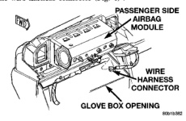
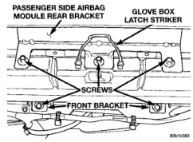

# REMOVAL AND INSTALLATION (Continued)

(6) If the airbag has been deployed, the clockspring and steering column must be replaced. See Clockspring in the Removal and Installation section of this group for the clockspring service procedures. Refer to Group 19 - Steering for the steering column service procedures.

(7) When installing the airbag module, connect the clockspring wire harness connector to the module by pressing straight in on the connector. Be certain that the connector is fully engaged by listening for a faint click. When the click is heard, the connector is latched.

(8) Connect the horn switch wire harness connector.

(9) Position the airbag module in the steering wheel. Be certain that the airbag and horn wiring is not pinched between the airbag module and the steering wheel armature.

(10) Install the airbag module mounting screws. Tighten the mounting screws to 10.2 N·m (90 in. lbs.).

(11) Do not connect the battery negative cable at this time. See Airbag System in the Diagnosis and Testing section of this group for the proper procedures.

**WARNING: THE PANEL OUTLET BARRELS INSTALLED IN THE PASSENGER SIDE AIRBAG DOOR PANEL OUTLET HOUSINGS MUST NEVER BE REINSTALLED FOLLOWING REMOVAL FOR ANY REASON. THEY MUST BE REPLACED WITH NEW BARRELS. REFER TO DUCTS AND OUTLETS IN THE REMOVAL AND INSTALLATION SECTION OF GROUP 24 - HEATING AND AIR CONDITIONING FOR SERVICE PROCEDURES. FAILURE TO OBSERVE THIS WARNING COULD RESULT IN OCCUPANT INJURIES UPON AIRBAG DEPLOYMENT.**

(1) Disconnect and isolate the battery negative cable. If the airbag has not been deployed, wait two minutes for the system capacitor to discharge before further service.

(2) Remove the glove box from the instrument panel. Refer to Glove Box in the Removal and Installation section of Group 8E - Instrument Panel Systems for the procedures.

(3) Remove the glove box opening upper trim strip from the instrument panel. Refer to Glove Box Opening Upper Trim Strip in the Removal and Installation section of Group 8E - Instrument Panel Systems for the procedures.

(4) Remove the four screws that secure the two plastic support brackets of the passenger side airbag door panel outlet housing to the glove box opening upper reinforcement.

(5) Reach through and above the glove box opening to access and unplug the passenger side airbag module wire harness connector (Fig. 4).

*Fig. 4 Passenger Side Airbag Module Wire Harness Connector*

(6) Remove the two screws that secure the passenger side airbag module front bracket to the instrument panel (Fig. 5).

*Fig. 5 Passenger Side Airbag Module Remove/Install*

(7) Remove the three screws that secure the passenger side airbag module rear bracket to the glove box opening upper reinforcement.

(8) Using a trim stick or another suitable wide flat-bladed tool and starting at the lower left edge, gently pry the passenger side airbag door away from the instrument panel top cover to release the five snap retainers (Fig. 6).

(9) Remove the passenger side airbag module and door from the instrument panel as a unit.

(10) Inspect the five slots in the instrument panel top cover airbag door opening and remove any airbag door snap retainers that did not remain on the airbag door tabs during removal.

---
*8M Passive Restraint Systems - Page 6*
