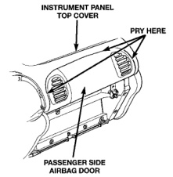

# REMOVAL AND INSTALLATION (Continued)

*Fig. 6 Passenger Side Airbag Door Remove/Install*

(11) Reverse the removal procedures to install. When reinstalling the airbag door to the instrument panel top cover, be certain that the snap retainers on the airbag door tabs are fully engaged in the five instrument panel top cover slots. Tighten the four passenger side airbag door panel outlet housing plastic support bracket mounting screws to 2.2 N·m (20 in. lbs.). Tighten the passenger side airbag module front and rear bracket mounting screws to 9 N·m (80 in. lbs.).

(12) Before reinstalling the glove box, be certain that the airbag module wire harness connector latches are fully engaged.

(13) Do not connect the battery negative cable at this time. See Airbag System in the Diagnosis and Testing section of this group for the proper procedures.

## DRIVER SIDE AIRBAG TRIM COVER AND HORN SWITCH

**WARNING: THE AIRBAG SYSTEM IS A SENSITIVE, COMPLEX ELECTROMECHANICAL UNIT. BEFORE ATTEMPTING TO DIAGNOSE OR SERVICE ANY AIRBAG SYSTEM OR RELATED STEERING WHEEL, STEERING COLUMN, OR INSTRUMENT PANEL COMPONENTS YOU MUST FIRST DISCONNECT AND ISOLATE THE BATTERY NEGATIVE (GROUND) CABLE. THEN WAIT TWO MINUTES FOR THE SYSTEM CAPACITOR TO DISCHARGE BEFORE FURTHER SYSTEM SERVICE. THIS IS THE ONLY SURE WAY TO DISABLE THE AIRBAG SYSTEM. FAILURE TO DO THIS COULD RESULT IN ACCIDENTAL AIRBAG DEPLOYMENT AND POSSIBLE PERSONAL INJURY.**

**WARNING: THE HORN SWITCH IS INTEGRAL TO THE AIRBAG MODULE TRIM COVER. SERVICE OF THIS COMPONENT SHOULD BE PERFORMED ONLY BY CHRYSLER-TRAINED AND AUTHORIZED DEALER SERVICE TECHNICIANS. FAILURE TO TAKE THE PROPER PRECAUTIONS OR TO FOLLOW THE PROPER PROCEDURES COULD RESULT IN ACCIDENTAL, INCOMPLETE, OR IMPROPER AIRBAG DEPLOYMENT AND POSSIBLE PERSONAL INJURY.**

(1) Disconnect and isolate the battery negative cable. If the airbag has not been deployed, wait two minutes for the system capacitor to discharge before further service.

(2) Remove the driver side airbag module from the steering wheel. See Airbag Module in the Removal and Installation section of this group for the procedures.

(3) Disengage the horn switch feed wire retainer from the hole in the trim cover retainer on the back of the airbag housing.

(4) Remove the three nuts that secure the trim cover retainer to the studs on the airbag housing.

(5) Remove the horn switch ground wire eyelet from the lower left airbag housing stud.

(6) Remove the trim cover retainer from the airbag housing studs.

(7) Disengage the six trim cover locking blocks from the lip around the outside edge of the airbag housing and remove the housing from the cover.

**WARNING: USE EXTREME CARE TO PREVENT ANY FOREIGN MATERIAL FROM ENTERING THE DRIVER SIDE AIRBAG MODULE, OR BECOMING ENTRAPPED BETWEEN THE DRIVER SIDE AIRBAG MODULE TRIM COVER AND THE DRIVER SIDE AIRBAG MODULE. FAILURE TO OBSERVE THIS WARNING COULD RESULT IN OCCUPANT INJURIES UPON AIRBAG DEPLOYMENT.**

(8) When reinstalling the trim cover and horn switch, be certain that the locking blocks are fully engaged on the lip of the airbag housing (Fig. 7).

(9) When reinstalling the trim cover retainer, be certain that the tabs on the retainer are engaged in each of the retainer slots of the trim cover.

(10) Install the horn switch ground wire eyelet over the lower left airbag housing stud.

(11) Install and tighten the trim cover retainer nuts to 10 N·m (90 in. lbs.).

(12) Reverse the remaining removal procedures to complete the installation, but do not connect the battery negative cable at this time. See Airbag System

---
*8M Passive Restraint Systems - Page 7*
