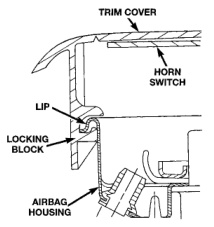
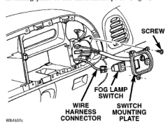
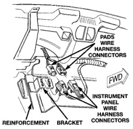

# REMOVAL AND INSTALLATION (Continued)

*Fig. 7 Airbag Trim Cover Locking Blocks Installed*

in the Diagnosis and Testing section of this group for the proper procedures.

## PASSENGER AIRBAG DISARM SWITCH

**WARNING: THE AIRBAG SYSTEM IS A SENSITIVE, COMPLEX ELECTROMECHANICAL UNIT. BEFORE ATTEMPTING TO DIAGNOSE OR SERVICE ANY AIRBAG SYSTEM OR RELATED STEERING WHEEL, STEERING COLUMN, OR INSTRUMENT PANEL COMPONENTS YOU MUST FIRST DISCONNECT AND ISOLATE THE BATTERY NEGATIVE (GROUND) CABLE. THEN WAIT TWO MINUTES FOR THE SYSTEM CAPACITOR TO DISCHARGE BEFORE FURTHER SYSTEM SERVICE. THIS IS THE ONLY SURE WAY TO DISABLE THE AIRBAG SYSTEM. FAILURE TO DO THIS COULD RESULT IN ACCIDENTAL AIRBAG DEPLOYMENT AND POSSIBLE PERSONAL INJURY.**

(1) Disconnect and isolate the battery negative cable. If the airbag has not been deployed, wait two minutes for the system capacitor to discharge before further service.

(2) Remove the cluster bezel from the instrument panel. Refer to Cluster Bezel in the Removal and Installation section of Group 8E - Instrument Panel Systems for the procedures.

(3) Remove the glove box from the instrument panel. Refer to Glove Box in the Removal and Installation section of Group 8E - Instrument Panel Systems for the procedures.

(4) Remove the three screws that secure the switch mounting plate to the instrument panel (Fig. 8).

*Fig. 8 Switch Mounting Plate Remove/Install*

(5) If the vehicle is equipped with fog lamps, pull the switch mounting plate away from the instrument panel far enough to access and unplug the wire harness connector from the back of the fog lamp switch.

(6) Reach through the glove box opening to access and unplug the two passenger airbag disarm switch wire harness connectors, located on a bracket on the inboard glove box opening reinforcement (Fig. 9).

*Fig. 9 Passenger Airbag Disarm Switch Connectors*

(7) Remove the switch mounting plate and passenger airbag disarm switch from the instrument panel as a unit.

---
*8M Passive Restraint Systems - Page 8*
