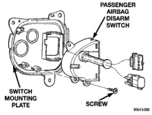
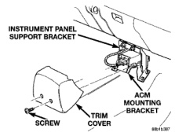
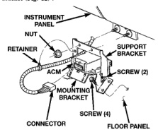

# REMOVAL AND INSTALLATION (Continued)

(8) Remove the three screws that secure the passenger airbag disarm switch to the switch mounting plate (Fig. 10).

*Fig. 10 Passenger Airbag Disarm Switch Remove/Install*

(9) Remove the passenger airbag disarm switch from the switch mounting plate.

(10) Reverse the removal procedures to install. Tighten the mounting screws to 2.2 N·m (20 in. lbs.).

(11) Do not connect the battery negative cable at this time. See Airbag System in the Diagnosis and Testing section of this group for the proper procedures.

## AIRBAG CONTROL MODULE

**WARNING: THE AIRBAG CONTROL MODULE CONTAINS THE IMPACT SENSOR, WHICH ENABLES THE SYSTEM TO DEPLOY THE AIRBAG. BEFORE ATTEMPTING TO DIAGNOSE OR SERVICE ANY AIRBAG SYSTEM OR RELATED STEERING WHEEL, STEERING COLUMN, OR INSTRUMENT PANEL COMPONENTS YOU MUST FIRST DISCONNECT AND ISOLATE THE BATTERY NEGATIVE (GROUND) CABLE. THEN WAIT TWO MINUTES FOR THE SYSTEM CAPACITOR TO DISCHARGE BEFORE FURTHER SYSTEM SERVICE. THIS IS THE ONLY SURE WAY TO DISABLE THE AIRBAG SYSTEM. FAILURE TO DO THIS COULD RESULT IN ACCIDENTAL AIRBAG DEPLOYMENT AND POSSIBLE PERSONAL INJURY.**

**WARNING: NEVER STRIKE OR KICK THE AIRBAG CONTROL MODULE, AS IT CAN DAMAGE THE IMPACT SENSOR OR AFFECT ITS CALIBRATION. IF AN AIRBAG CONTROL MODULE IS ACCIDENTALLY DROPPED DURING SERVICE, THE MODULE MUST BE SCRAPPED AND REPLACED WITH A NEW UNIT.**

(1) Disconnect and isolate the battery negative cable. If the airbag has not been deployed, wait two minutes for the system capacitor to discharge before further service.

(2) If the vehicle is equipped with a manual transmission, remove the center console from the floor panel transmission tunnel. Refer to Group 23 - Body for the procedures.

(3) If the vehicle is equipped with an automatic transmission, remove the two screws that secure the trim cover to the airbag control module mounting bracket, then pull the top of the trim cover rearward to release the two snap clips from the instrument panel support bracket (Fig. 11).

*Fig. 11 Airbag Control Module Trim Cover Remove/Install*

(4) Loosen but do not remove the two screws on the sides that secure the instrument panel support bracket to the airbag control module mounting bracket (Fig. 12).

*Fig. 12 Airbag Control Module Remove/Install*

---
*8M Passive Restraint Systems - Page 9*
