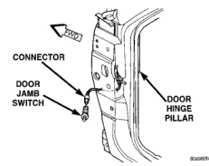
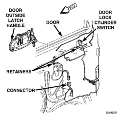

# VEHICLE THEFT/SECURITY SYSTEMS

## DIAGNOSIS AND TESTING (Continued)

> **WARNING: ON VEHICLES EQUIPPED WITH AIRBAGS, REFER TO GROUP 8M - PASSIVE RESTRAINT SYSTEMS BEFORE ATTEMPTING ANY STEERING WHEEL, STEERING COLUMN, OR INSTRUMENT PANEL COMPONENT DIAGNOSIS OR SERVICE. FAILURE TO TAKE THE PROPER PRECAUTIONS COULD RESULT IN ACCIDENTAL AIRBAG DEPLOYMENT AND POSSIBLE PERSONAL INJURY.**

Remove the relay (Fig. 1) from the PDC as described in this group to perform the following tests:

1. A relay in the de-energized position should have continuity between terminals 87A and 30, and no continuity between terminals 87 and 30. If OK, go to Step 2. If not OK, replace the faulty relay.

2. Resistance between terminals 85 and 86 (electromagnet) should be 75 +/- 5 ohms. If OK, go to Step 3. If not OK, replace the faulty relay.

3. Connect a battery to terminals 85 and 86. There should now be continuity between terminals 30 and 87, and no continuity between terminals 87A and 30. If OK, test the relay circuits. If not OK, replace the faulty relay.

*Fig. 1 Relay Terminals*

## REMOVAL AND INSTALLATION

### DOOR JAMB SWITCH

1. Disconnect and isolate the battery negative cable.

2. Grasp the body of the door jamb switch with a pair of pliers and move the switch gently back-and-forth while pulling it out of the door hinge pillar mounting hole.

3. Pull the door jamb switch out from the pillar far enough to access the wire harness connector (Fig. 2).

4. Unplug the door jamb switch from the wire harness connector.

5. Reverse the removal procedures to install.

*Fig. 2 Door Jamb Switch Remove/Install*

### DOOR LOCK CYLINDER SWITCH

1. Disconnect and isolate the battery negative cable.

2. Remove the door outside latch handle mounting hardware and linkage from the inside of the door. Refer to Group 23 - Body for the procedures.

3. From the outside of the door, pull the door outside latch handle out far enough to access the door lock cylinder switch (Fig. 3).

[Figure]

*Fig. 3 Door Lock Cylinder Switch Remove/Install - Typical*

4. Disengage the door lock cylinder switch from the back of the lock cylinder.

5. Unplug the door lock cylinder switch wire harness connector.

---
*Vehicle Theft/Security Systems - Page 4*
