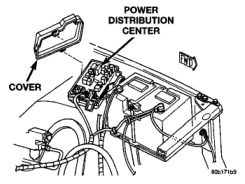
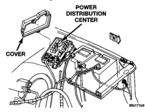

# VEHICLE THEFT/SECURITY SYSTEMS

## REMOVAL AND INSTALLATION (Continued)

6. Disengage the retainers that secure the door lock cylinder switch wire harness to the inner door panel.

7. Remove the door lock cylinder switch from the door.

8. Reverse the removal procedures to install.

### HEADLAMP RELAY

1. Disconnect and isolate the battery negative cable.

2. Remove the cover from the Power Distribution Center (PDC) (Fig. 4).

*Fig. 4 Power Distribution Center*

3. Refer to the label on the PDC for headlamp (or security) relay identification and location.

4. Unplug the headlamp relay from the PDC.

5. Install the headlamp relay by aligning the relay terminals with the cavities in the PDC and pushing the relay firmly into place.

6. Install the PDC cover.

7. Connect the battery negative cable.

8. Test the relay operation.

### HORN RELAY

1. Disconnect and isolate the battery negative cable.

2. Remove the cover from the Power Distribution Center (PDC) (Fig. 5).

*Fig. 5 Power Distribution Center*

3. Refer to the label on the PDC for horn relay identification and location.

4. Unplug the horn relay from the PDC.

5. Install the horn relay by aligning the relay terminals with the cavities in the PDC and pushing the relay firmly into place.

6. Install the PDC cover.

7. Connect the battery negative cable.

8. Test the relay operation.

---
*Vehicle Theft/Security Systems - Page 5*
