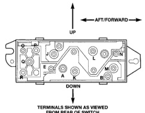

# POWER SEAT SYSTEMS (Continued)

## DIAGNOSIS AND TESTING (Continued)

(1) Test the circuit breaker in the junction block as described in this group. If OK, go to Step 2. If not OK, replace the faulty circuit breaker.

(2) Remove the power seat switch from the seat. Check for battery voltage at the fused B(+) circuit cavity of the power seat switch wire harness connector. If OK, go to Step 3. If not OK, repair the open circuit to the junction block as required.

(3) Check for continuity between the ground circuit cavity of the power seat switch wire harness connector and a good ground. There should be continuity. If OK, go to Step 4. If not OK, repair the open circuit to ground as required.

(4) Test the power seat switch as described in this group. If the switch tests OK, check the wire harness for the inoperative power seat motor(s) between the power seat switch and the motor for shorts or opens. If the circuits check OK, replace the faulty power seat adjuster and motors assembly. If the circuits are not OK, repair the wire harness as required.

### POWER LUMBAR ADJUSTER AND MOTOR

For circuit descriptions and diagrams, refer to 8W-63 - Power Seat in Group 8W - Wiring Diagrams.

Operate the power seat switch to inflate and deflate the power lumbar support. The lumbar support should inflate and deflate as selected. If the power lumbar support fails to operate in only one direction, move the support a short distance in the opposite direction and test again to be certain that the support is not already fully inflated or deflated. If the power lumbar support still fails to operate in only one direction, see Power Seat Switch in the Diagnosis and Testing section of this group. If the power lumbar support fails to operate in more than one direction, proceed as follows:

(1) Test the circuit breaker in the junction block as described in this group. If OK, go to Step 2. If not OK, replace the faulty circuit breaker.

(2) Remove the power seat switch from the seat. Check for battery voltage at the fused B(+) circuit cavity of the power seat switch wire harness connector. If OK, go to Step 3. If not OK, repair the open circuit to the junction block as required.

(3) Check for continuity between the ground circuit cavity of the power seat switch wire harness connector and a good ground. There should be continuity. If OK, go to Step 4. If not OK, repair the open circuit to ground as required.

(4) Test the power seat switch as described in this group. If the switch tests OK, check the wire harness between the power seat switch and the power lumbar support motor for shorts or opens. If the circuits check OK, replace the faulty power lumbar support adjuster and motor assembly. If the circuits are not OK, repair the wire harness as required.

### POWER SEAT SWITCH

For circuit descriptions and diagrams, refer to 8W-63 - Power Seat in Group 8W - Wiring Diagrams.

(1) Disconnect and isolate the battery negative cable.

(2) Remove the power seat switch from the power seat.

(3) Use an ohmmeter to test the continuity of the power seat switches in each position. See the Power Seat Switch Continuity chart (Fig. 1). If OK, see Power Seat Adjuster and Motors or Power Lumbar Adjuster and Motor in the Diagnosis and Testing section of this group. If not OK, replace the faulty power seat switch module.

*Fig. 1*

**POWER SEAT SWITCH CONTINUITY**

| SWITCH POSITION | CONTINUITY BETWEEN |
|-----------------|-------------------|
| OFF | B-N, B-J, B-M, B-E, B-L, B-K |
| VERTICAL UP | A-E, A-M, B-N, B-J |
| VERTICAL DOWN | A-J, A-N, B-M, B-E |
| HORIZONTAL FORWARD | A-L, B-K |
| HORIZONTAL AFT | A-K, B-L |
| FRONT TILT UP | A-M, B-N |
| FRONT TILT DOWN | A-N, B-M |
| REAR TILT UP | A-E, B-J |
| REAR TILT DOWN | A-J, B-E |
| LUMBAR OFF | O-P, P-R |
| LUMBAR UP (INFLATE) | O-P, Q-R |

*Fig. 1 Power Seat Switch Continuity*

---
*8R Power Seat Systems - Page 3*
