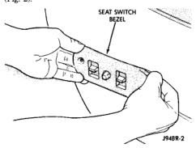
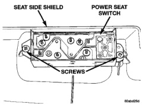
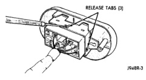

# POWER SEAT SYSTEMS (Continued)

## REMOVAL AND INSTALLATION

### POWER SEAT SWITCH

#### STANDARD CAB

(1) Disconnect and isolate the battery negative cable.

(2) Remove the two screws that secure the power seat switch and bezel unit to the seat cushion frame (Fig. 2).

*Fig. 2 Seat Switch and Bezel Remove/Install*

(3) Pull the switch and bezel unit out from the seat far enough to access the switch wire harness connector. Gently pry the locking tabs of the switch away from the wire harness connector and carefully unplug the connector from the power seat switch module (Fig. 3).

*Fig. 3 Power Seat Switch Connector Remove*

(4) Remove the two screws that secure the power seat switch module to the bezel and remove the bezel.

(5) Reverse the removal procedures to install. Tighten the switch mounting screws to 2.2 N-m (20 in. lbs.).

#### EXTENDED CAB

(1) Disconnect and isolate the battery negative cable.

(2) Remove the screw that secures the recliner lever to the recliner mechanism release shaft on the outboard side of the driver side front seat.

(3) Pull the recliner lever off of the recliner mechanism release shaft.

(4) Remove the three screws that secure the driver side seat cushion side shield to the outboard seat cushion frame.

(5) Pull the driver side seat cushion side shield away from the seat cushion frame far enough to access the power seat switch module wire harness connector.

(6) Gently pry the locking tabs of the switch away from the wire harness connector and carefully unplug the connector from the power seat switch module.

(7) Remove the seat cushion side shield and power seat switch module from the seat as a unit.

(8) Remove the two screws that secure the power seat switch to the inside of the seat cushion side shield (Fig. 4).

*Fig. 4 Power Seat Switch Remove/Install - Typical*

(9) Remove the power seat switch from the seat cushion side shield.

(10) Reverse the removal procedures to install. Tighten the switch mounting screws to 2.2 N-m (20 in. lbs.).

### POWER SEAT ADJUSTER AND MOTORS

(1) Disconnect and isolate the battery negative cable.

(2) Remove the driver side seat, adjuster and motors assembly from the vehicle as a unit. Refer to Group 23 - Body for the procedures.

(3) Unplug the power seat wire harness connectors at each of the three power seat motors.

(4) Release the power seat wire harness retainers from the seat adjuster and motors assembly.

---
*8R Power Seat Systems - Page 4*
