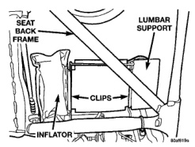

# POWER SEAT SYSTEMS (Continued)

## REMOVAL AND INSTALLATION (Continued)

(5) Remove the fasteners that secure the center seat cushion section to the brackets on the power seat adjuster.

(6) Remove the screws that secure the power seat adjuster and motors assembly to the seat cushion frame.

(7) Remove the power seat adjuster and motors assembly from the seat cushion frame.

(8) Reverse the removal procedures to install.

### POWER LUMBAR ADJUSTER AND MOTOR

(1) Disconnect and isolate the battery negative cable.

(2) Remove the trim from the driver side seat back. Refer to Group 23 - Body for the procedures.

(3) Unplug the wire harness connector at the power lumbar inflator motor.

(4) Unhook the power lumbar adjuster and motor assembly clips from the steel support rod welded to the seat back frame (Fig. 5).

(5) Remove the power lumbar adjuster and motor assembly from the seat back frame.

*Fig. 5 Power Lumbar Adjuster and Motor Remove/Install*

(6) Reverse the removal procedures to install.

---
*8R Power Seat Systems - Page 5*
