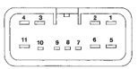
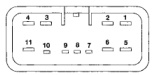

# POWER WINDOW SYSTEMS

## DIAGNOSIS AND TESTING (Continued)

power windows operate, see Power Window System in the Diagnosis and Testing section of this group.

### POWER WINDOW SWITCH

The Light-Emitting Diode (LED) illumination lamps for all of the power window and lock switch and bezel unit switch paddles receive battery current through the power window circuit breaker in the junction block. If all of the LEDs are inoperative in either or both power window and lock switch and bezel units and the power windows are inoperative, perform the diagnosis for Power Window System in this group. If the power windows operate, but any or all of the LEDs are inoperative, the power window and lock switch and bezel unit with the inoperative LED(s) is faulty and must be replaced. For circuit descriptions and diagrams, refer to 8W-60 - Power Windows in Group 8W - Wiring Diagrams.

1. Check the circuit breaker in the junction block. If OK, go to Step 2. If not OK, replace the faulty circuit breaker.

2. Turn the ignition switch to the On position. Check for battery voltage at the circuit breaker in the junction block. If OK, turn the ignition switch to the Off position and go to Step 3. If not OK, repair the circuit to the ignition switch as required.

3. Disconnect and isolate the battery negative cable. Remove the power window and lock switch and bezel unit from the door trim panel. Unplug the wire harness connector from the switch and bezel unit.

4. Test the power window switch continuity. See the Power Window Switch Continuity charts to determine if the continuity is correct in the Neutral, Up and Down switch positions (Fig. 1) or (Fig. 2). If OK, see Power Window Motor in the Diagnosis and Testing section of this group. If not OK, replace the faulty switch.

### POWER WINDOW MOTOR

For circuit descriptions and diagrams, refer to 8W-60 - Power Windows in Group 8W - Wiring Diagrams. Before you proceed with this diagnosis, confirm proper switch operation. See Power Window Switch in the Diagnosis and Testing section of this group.

1. Disconnect and isolate the battery negative cable. Remove the trim panel from the door with the inoperative power window.

2. Unplug the power window motor wire harness connector. Apply 12 volts across the motor terminals to check its operation in one direction. Reverse the connections across the motor terminals to check the operation in the other direction. Remember, if the window is in the full up or full down position, the motor will not operate in that direction by design. If OK, repair the circuits from the power window motor

*Fig. 1*

**DRIVER SIDE WINDOW SWITCH CONTINUITY**

| SWITCH POSITION | BETWEEN |
|-----------------|---------|
| NEUTRAL | 1 & 3, 2 & 3, 3 & 4, 3 & 6 |
| LEFT UP | 3 & 4, 5 & 6 |
| RIGHT UP | 1 & 5, 2 & 3 |
| LEFT DOWN | 3 & 6, 4 & 5 |
| RIGHT DOWN | 1 & 3, 2 & 5 |
| LAMP | 3 & 5 |

*Fig. 1 Power Window Switch Continuity - Driver Side*

*Fig. 2*

**PASSENGER SIDE WINDOW SWITCH CONTINUITY**

| SWITCH POSITION | BETWEEN |
|-----------------|---------|
| NEUTRAL | 1 & 4, 2 & 3 |
| UP | 2 & 3, 4 & 11 |
| DOWN | 1 & 4, 3 & 11 |
| LAMP | 8 & 11 |

*Fig. 2 Power Window Switch Continuity - Passenger Side*

---
*Power Window Systems - Page 3*
