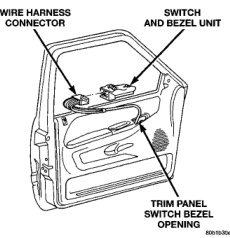

# POWER WINDOW SYSTEMS

## DIAGNOSIS AND TESTING (Continued)

to the power window switch as required. If not OK, replace the faulty motor.

3. If the motor operates in both directions, check the operation of the window glass and lift mechanism through its complete up and down travel. There should be no binding or sticking of the window glass or lift mechanism through the entire travel range. If not OK, refer to Group 23 - Body to check the window glass, tracks, and regulator for sticking, binding, or improper adjustment.

## REMOVAL AND INSTALLATION

### POWER WINDOW SWITCH

1. Disconnect and isolate the battery negative cable.

2. Using a wide flat-bladed tool such as a trim stick, gently pry the upper edge of the switch bezel to release the retainer that secures the switch bezel to the door trim panel opening (Fig. 3).

3. Pull the switch and bezel unit away from the door trim panel opening far enough to access and unplug the wire harness connector.

4. Remove the power window and lock switch and bezel unit from the door trim panel.

5. Reverse the removal procedures to install. When installing the switch and bezel unit to the door trim panel opening, insert the rear of the bezel into the opening, then push down on the front of the bezel until the retaining tab snaps into place.

### POWER WINDOW MOTOR

The power window motor and mechanism is integral to the power window regulator unit. If the power

*Fig. 3 Power Window and Lock Switch and Bezel Unit Remove/Install*

window motor or mechanism is faulty or damaged, the entire power window regulator unit must be replaced. Refer to Group 23 - Body for the window regulator service procedures.

---
*Power Window Systems - Page 4*
