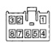
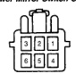

# POWER MIRROR SYSTEMS (Continued)

## DESCRIPTION AND OPERATION (Continued)

driver side door trim panel. The switch knob is rotated clockwise (right mirror control), or counterclockwise (left mirror control) to select the mirror to be adjusted. The switch knob is then moved in a joystick fashion to control movement of the selected mirror up, down, right, or left.

The power mirror switch cannot be repaired and, if faulty or damaged, it must be replaced. The power switch knob is available for service replacement.

## DIAGNOSIS AND TESTING

### POWER MIRROR SYSTEM

For circuit descriptions and diagrams, refer to 8W-62 - Power Mirrors in Group 8W - Wiring Diagrams.

(1) Check the fuses in the Power Distribution Center (PDC) and the junction block. If OK, go to Step 2. If not OK, repair the shorted circuit or component as required and replace the faulty fuse(s).

(2) Check for battery voltage at the fuse in the junction block. If OK, go to Step 3. If not OK, repair the open circuit to the PDC as required.

(3) Disconnect and isolate the battery negative cable. Remove the driver side door trim panel and unplug the wire harness connector from the power mirror switch. Connect the battery negative cable. Check for battery voltage at the fused B(+) circuit cavity in the door wire harness half of the power mirror switch wire harness connector. If OK, go to Step 4. If not OK, repair the open circuit to the junction block as required.

(4) Disconnect and isolate the battery negative cable. Check for continuity between the ground circuit cavity in the door wire harness half of the power mirror switch wire harness connector and a good ground. There should be continuity. If OK, go to Step 5. If not OK, repair the circuit to ground as required.

(5) Check the power mirror switch continuity as shown in (Fig. 1). If OK, go to Step 6. If not OK, replace the faulty switch.

(6) Unplug the wire harness connector at the inoperative power mirror. Use two jumper wires, one connected to a 12-volt battery feed, and the other connected to a good body ground. See the Power Mirror Test chart for the correct jumper wire connections to the power mirror half of the power mirror wire harness connector (Fig. 2). If the power mirror(s) do not respond as indicated in the chart, replace the faulty power mirror assembly. If the power mirror(s) do respond as indicated in the chart, repair the circuits between the power mirror and the power mirror switch for a short or open as required.

*Fig. 1*

**MIRROR SELECTOR KNOB IN "L" POSITION**

| MOVE LEVER | CONTINUITY BETWEEN |
|------------|-------------------|
| UP | Pins 3 and 8, 1 and 7, 4 and 7 |
| RIGHT | Pins 3 and 7, 2 and 8, 5 and 8 |
| DOWN | Pins 3 and 7, 1 and 8, 4 and 8 |
| LEFT | Pins 3 and 8, 2 and 7, 5 and 7 |

**MIRROR SELECTOR KNOB IN "R" POSITION**

| MOVE LEVER | CONTINUITY BETWEEN |
|------------|-------------------|
| UP | Pins 6 and 8, 1 and 7, 4 and 7 |
| RIGHT | Pins 6 and 7, 2 and 8, 5 and 8 |
| DOWN | Pins 6 and 7, 1 and 8, 4 and 8 |
| LEFT | Pins 6 and 8, 2 and 7, 5 and 7 |

*Fig. 1 Power Mirror Switch Continuity*

*Fig. 2*

**POWER MIRROR TEST**

| MIRROR MOVEMENT | 12 Volts | Ground |
|-----------------|----------|--------|
| UP | Pin 3 | Pin 1 |
| DOWN | Pin 1 | Pin 3 |
| LEFT | Pin 2 | Pin 1 |
| RIGHT | Pin 1 | Pin 2 |

*Fig. 2 Power Mirror Test*

## REMOVAL AND INSTALLATION

### POWER MIRROR SWITCH

(1) Disconnect and isolate the battery negative cable.

(2) Pull the control knob rearward to remove it from the power mirror switch stem (Fig. 3).

(3) Remove the nut that secures the power mirror switch to the driver side front door trim panel.

(4) Remove the trim panel from the inside of the driver side front door. Refer to Group 23 - Body for the procedures.

---
*8T Power Mirror Systems - Page 2*
