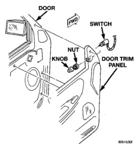
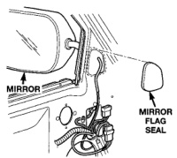
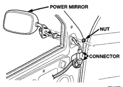

# POWER MIRROR SYSTEMS (Continued)

## REMOVAL AND INSTALLATION (Continued)

*Fig. 3 Power Mirror Switch Remove/Install*

(5) Pull the trim panel away from the inner door far enough to access the power mirror switch wire harness connector.

(6) Unplug the power mirror switch wire harness connector.

(7) Remove the power mirror switch from the back of the door trim panel.

(8) Reverse the removal procedures to install.

### POWER MIRROR

(1) Disconnect and isolate the battery negative cable.

(2) Remove the trim panel from the inside of the front door. Refer to Group 23 - Body for the procedures.

(3) Remove the mirror flag seal from the inner door panel (Fig. 4).

(4) Unplug the wire harness connector from the power mirror (Fig. 5).

(5) Remove the three nuts that secure the power mirror to the inner door panel.

*Fig. 4 Mirror Flag Seal Remove/Install*

*Fig. 5 Power Mirror Remove/Install*

(6) Unseat the power mirror wire harness grommet by pushing it out through the hole in the door flag from the inside.

(7) Pull the mirror from the outside of the door while feeding the wire harness, grommet, and connector out through the hole from the inside of the door.

(8) Reverse the removal procedures to install. Tighten the mounting nuts to 7.5 N-m (65 in. lbs.).

---
*8T Power Mirror Systems - Page 3*
