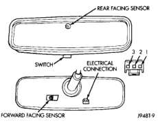
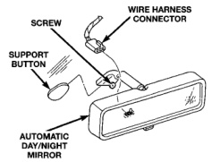

# POWER MIRROR SYSTEMS (Continued)

## DIAGNOSIS AND TESTING (Continued)

position. Check for battery voltage at the fused ignition switch output (run/start) circuit cavity of the automatic day/night mirror wire harness connector. If OK, go to Step 4. If not OK, repair the open circuit to the junction block as required.

*Fig. 1 Automatic Day/Night Mirror*

(4) Turn the ignition switch to the Off position. Disconnect and isolate the battery negative cable. Check for continuity between the ground circuit cavity of the automatic day/night mirror wire harness connector and a good ground. There should be continuity. If OK, go to Step 5. If not OK, repair the circuit to ground as required.

(5) Connect the battery negative cable. Turn the ignition switch to the On position. Set the parking brake. Place the transmission gear selector lever in the Reverse position. Check for battery voltage at the backup lamp switch output circuit cavity of the automatic day/night mirror wire harness connector. If OK, go to Step 6. If not OK, repair the open circuit as required.

(6) Turn the ignition switch to the Off position. Disconnect the battery negative cable. Plug in the automatic day/night mirror wire harness connector. Connect the battery negative cable. Turn the ignition switch to the On position. Place the transmission gear selector lever in the Neutral position. Place the mirror switch in the On (LED in the mirror switch is lighted) position. Cover the forward facing ambient photocell sensor to keep out any ambient light.

**NOTE:** The ambient photocell sensor must be covered completely, so that no light reaches the sensor. Use a finger pressed tightly against the sensor, or cover the sensor completely with electrical tape.

(7) Shine a light into the rearward facing headlamp photocell sensor. The mirror glass should darken. If OK, go to Step 8. If not OK, replace the faulty automatic day/night mirror unit.

(8) With the mirror glass darkened, place the transmission gear selector lever in the Reverse position. The mirror should return to its normal reflectance. If not OK, replace the faulty automatic day/night mirror unit.

## REMOVAL AND INSTALLATION

### AUTOMATIC DAY/NIGHT MIRROR

(1) Disconnect and isolate the battery negative cable.

(2) Unplug the wire harness connector from the automatic day/night mirror (Fig. 2).

*Fig. 2 Automatic Day/Night Mirror Remove/Install*

(3) Remove the set screw that secures the automatic day/night mirror to the windshield support button.

(4) Push the automatic day/night mirror upwards far enough for the mounting bracket to clear the support button and remove the mirror from the windshield.

(5) Reverse the removal procedures to install. Tighten the mounting screw to 1 N-m (9 in. lbs.).

---
*8T Power Mirror Systems - Page 5*
