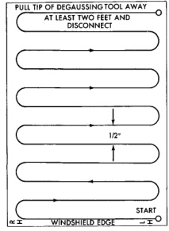
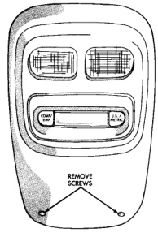

# SERVICE PROCEDURES (Continued)

To demagnetize the roof panel, proceed as follows:

(1) Be certain the ignition switch is in the Off position, before you begin the demagnetizing procedure.

(2) Place a piece of paper approximately 22 by 28 centimeters (8.5 by 11 inches), oriented on the vehicle lengthwise from front to rear, on the center line of the roof at the windshield header (Fig. 2). The purpose of the paper is to protect the roof panel from scratches, and to define the area to be demagnetized.

*Fig. 2 Roof Demagnetizing Pattern*

(3) Plug in the degaussing tool, while keeping the tool at least 61 centimeters (2 feet) away from the compass unit.

(4) Slowly approach the center line of the roof panel at the windshield header, with the degaussing tool plugged in.

(5) Contact the roof panel with the plastic coated tip of the degaussing tool. Be sure that the template is in place to avoid scratching the roof panel. Using a slow, back-and-forth sweeping motion, and allowing 13 millimeters (0.50 inch) between passes, move the tool at least 11 centimeters (4 inches) to each side of the roof center line, and 28 centimeters (11 inches) back from the windshield header.

(6) With the degaussing tool still energized, slowly back it away from the roof panel. When the tip of the tool is at least 61 centimeters (2 feet) from the roof panel, unplug the tool.

(7) Calibrate the compass and adjust the compass variance as described in the Service Procedures section of this group.

## REMOVAL AND INSTALLATION

### OVERHEAD CONSOLE

(1) Disconnect and isolate the battery negative cable.

(2) Remove the two screws that secure the front of the overhead console to the windshield header (Fig. 3).

*Fig. 3 Overhead Console Mounting Screws*

(3) Pull the front of the console down slightly, then slide the console rearward to disengage the two mounting clips that secure the rear of the overhead console to the inner roof panel reinforcement (Fig. 4).

(4) Lower the overhead console from the headliner far enough to access and unplug the wire harness connector from the compass and thermometer display module.

(5) Reverse the removal procedures to install. Tighten the mounting screws to 2.2 N-m (20 in. lbs.).

---
*8V - Overhead Console Systems - Page 6*
