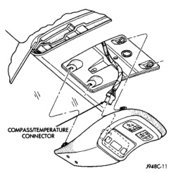
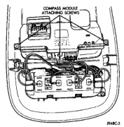
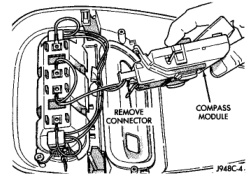

# REMOVAL AND INSTALLATION (Continued)

*Fig. 4 Overhead Console Remove/Install*

### COMPASS AND THERMOMETER DISPLAY MODULE

(1) Disconnect and isolate the battery negative cable.

(2) Remove the overhead console from the headliner. See Overhead Console in the Removal and Installation section of this group for the procedures.

(3) Remove the three screws that secure the compass and thermometer display module to the overhead console housing (Fig. 5).

(4) Unplug the lighting wire harness connector from the compass and thermometer display module (Fig. 6).

(5) Remove the compass and thermometer display module from the overhead console housing.

(6) Reverse the removal procedures to install. Tighten the mounting screws to 2.2 N-m (20 in. lbs.).

### READING AND COURTESY LAMP BULB

(1) Disconnect and isolate the battery negative cable.

(2) Insert a long, narrow, flat-bladed tool in the notch on the curved edge of the reading and courtesy lamp lens.

(3) Gently pry the lens downward from the overhead console housing and pivot the lens down. It may

*Fig. 5 Compass and Thermometer Display Module Remove/Install*

*Fig. 6 Lighting Wire Harness Connector*

be necessary to move the tool along the edge of the lens to free the lens from the console housing.

(4) Remove the bulb by pulling it straight down from the bulb holders.

(5) Install a new bulb by aligning its ends with the bulb holders, and pushing it firmly into place.

(6) Pivot the lens back up into position and press upward firmly until it snaps back into place.

(7) Connect the battery negative cable.

(8) Test the lamp by depressing the lens to check for proper lamp switching and lighting.

---
*8V - Overhead Console Systems - Page 7*
