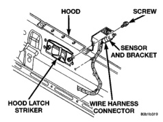
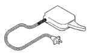

# REMOVAL AND INSTALLATION (Continued)

### AMBIENT TEMPERATURE SENSOR

(1) Disconnect and isolate the battery negative cable.

(2) Locate the ambient temperature sensor, on the underside of the hood near the hood latch striker (Fig. 7).

*Fig. 7 Ambient Temperature Sensor Remove/Install*

(3) Unplug the wire harness connector from the ambient temperature sensor.

(4) Remove the screw that secures the ambient temperature sensor to the inner hood reinforcement.

(5) Remove the ambient temperature sensor from under the hood.

(6) Reverse the removal procedures to install. Tighten the ambient temperature sensor mounting screw to 5.6 N-m (50 in. lbs.).

## SPECIAL TOOLS

### COMPASS

*Fig. 8*

*Degaussing Tool 6029*

---
*8V - Overhead Console Systems - Page 8*
