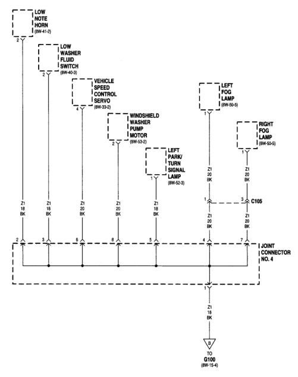

## 8W-15 GROUND DISTRIBUTION

*Fig. 1 Fig. 8W-15-3 Ground Distribution Wiring Diagram*
- LOW NOTE HORN (8W-41-3)
- LOW WASHER FLUID SWITCH (8W-53-2)
- VEHICLE SPEED CONTROL SERVO (8W-33-2)
- WINDSHIELD WASHER PUMP MOTOR (8W-53-2)
- LEFT PARK/TURN SIGNAL LAMP (8W-52-3)
- LEFT FOG LAMP (8W-50-5)
- RIGHT FOG LAMP (8W-50-5)
- C105
- JOINT CONNECTOR NO. 4
- TO G100 (8W-15-4)

BR8D/1503

J08BW-9