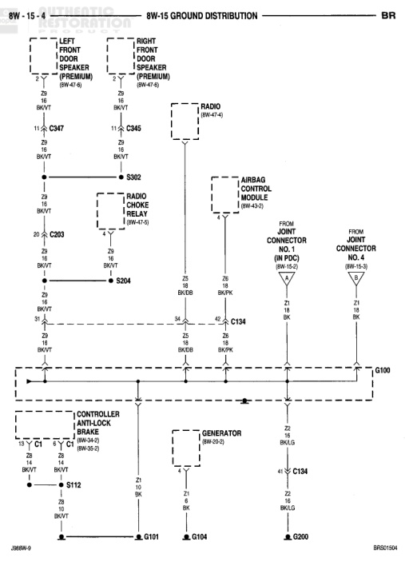

## 8W-15 GROUND DISTRIBUTION (continued)

*Fig. 1 Fig. 8W-15-4 Ground Distribution Wiring Diagram*
- LEFT FRONT DOOR TWEETER (PREMIUM) (8W-47-6)
- RIGHT FRONT DOOR TWEETER (PREMIUM) (8W-47-6)
- C347
- C345
- RADIO (8W-47-6)
- S302
- RADIO CHOKE RELAY (8W-47-10)
- C203
- S204
- AIRBAG CONTROL MODULE (8W-43-2)
- FROM JOINT CONNECTOR NO. 3 (IN PDC) (8W-15-2)
- FROM JOINT CONNECTOR NO. 4 (8W-15-3)
- C134
- G100
- CONTROLLER ANTILOCK BRAKE (8W-34-2) (8W-29-2)
- S112
- GENERATOR (8W-20-2)
- C134
- G101
- G104
- G200

J08BW-9

BR8D/1504