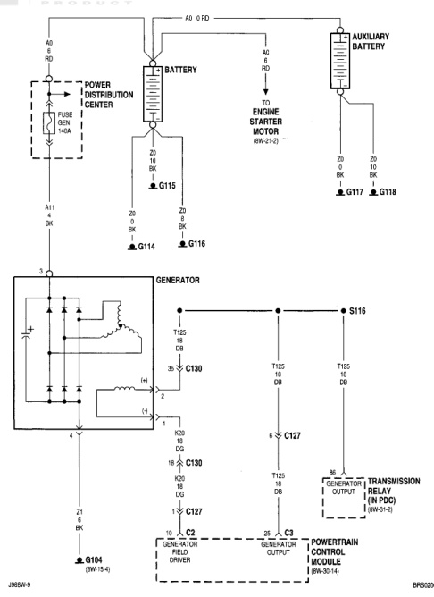

# 8W-20 CHARGING SYSTEM (continued)

*Fig. 1 8W-20 Charging System Wiring Diagram*
- AUXILIARY BATTERY
- BATTERY
- POWER DISTRIBUTION CENTER (with FUSE GEN 140A)
- ENGINE STARTER MOTOR (8W-13-3)
- GENERATOR with internal components:
  - S116 connection
  - T125 (LB/OR)
  - C130 connector
  - Y03 (DG)
  - C130 connector (K20/DG, L31)
  - C127 connector
- TRANSMISSION RELAY (IN PDC) (8W-51-3)
- POWERTRAIN CONTROL MODULE (8W-30-14)
- Ground points: G104 (8W-14-4), G114, G115, G116, G117, G118
- Connectors: C2 (GENERATOR FIELD DRIVER), C3 (GENERATOR OUTPUT)
- Wire connections: A0 (5 RD), Z1 (20 BK), J2 (20 BK), J20 (20 BK), A11 (20 BK)