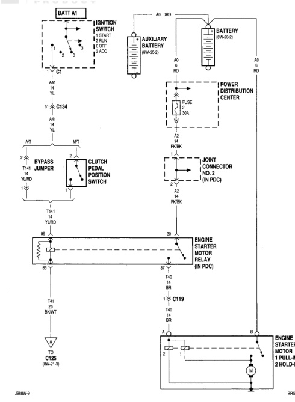

*Fig. 1 8W-21 Starting System Wiring Diagram*
- BATT A1: Battery with ignition switch connections (OFF, START, RUN, ACC)
- C1: Connector
- C134: Ground connection
- A7: Bypass jumper connection
- MT: Manual transmission clutch pedal position switch
- T141: Ground connection (YLRD)
- BR: Ground connections
- C125 (8W-21-3): Ground point
- A0 GRD: Auxiliary battery ground
- AUXILIARY BATTERY (8W-20-2): Secondary battery
- BATTERY (8W-20-2): Main battery
- POWER DISTRIBUTION CENTER: Fuse 2 (30A)
- A2 PN/BK: Power distribution connection
- JOINT CONNECTOR (NO. 2) (8W PDC): Connector junction
- A4 PN/BK: Connection to starter relay
- ENGINE STARTER MOTOR RELAY (8W PDC): Starter relay with BR and T40 connections
- C119: Connector
- ENGINE STARTER MOTOR 1 PULL-IN 2 HOLD-IN: Starter motor with pull-in and hold-in coils