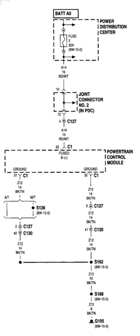

# 8W-30 FUEL/IGNITION SYSTEM

*Fig. 1 Fig. 8W-30-2 Fuel/Ignition System Wiring Diagram - Power Distribution*
- BATT A0: Battery connection with 30A fuse (8W-15-2)
- A14 RD/WT: Power distribution to joint connector
- Joint Connector No. 2 (JB PDC)
- C127: Connection point
- C1: Fused B (+) connection to Powertrain Control Module
- Ground connections
- Z12 BK/TN: Ground path
- A/T and M/T circuit paths
- S126 (8W-15-6): Circuit connection
- C127, C130, C130: Multiple connection points
- S162 (8W-15-5): Circuit connection
- S168 (8W-15-6): Circuit connection
- G105 (8W-15-6): Ground connection