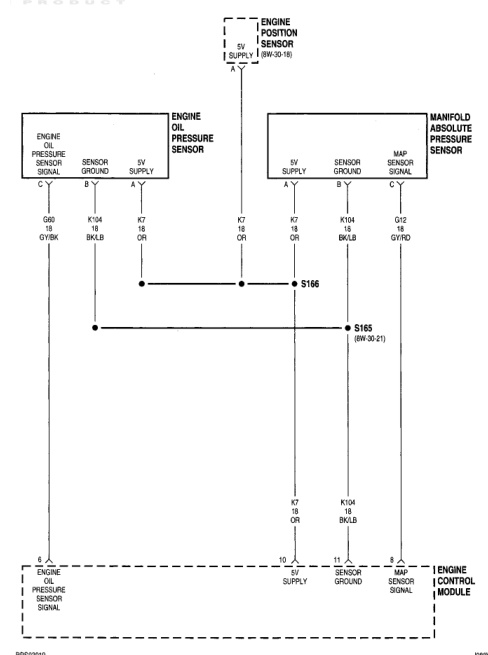

# 8W-30-19

## BW-30 FUEL/IGNITION SYSTEM

*Fig. 1 Fig. BRS03019 - Engine Oil Pressure and Manifold Absolute Pressure Sensor Wiring Diagram*
- ENGINE OIL PRESSURE SENSOR
  - SENSOR GROUND (B-Y)
  - SENSOR SIGNAL (A-Y)
- ENGINE POSITION SENSOR (5V SUPPLY) (8W-30-18)
- MANIFOLD ABSOLUTE PRESSURE SENSOR
  - 5V SUPPLY (A-Y)
  - SENSOR GROUND (B-Y)
  - MAP SENSOR SIGNAL (C-Y)
- Connectors: S166, S165 (8W-30-21)
- ENGINE CONTROL MODULE
  - ENGINE OIL PRESSURE SENSOR SIGNAL
  - 5V SUPPLY
  - SENSOR GROUND
  - MAP SENSOR SIGNAL