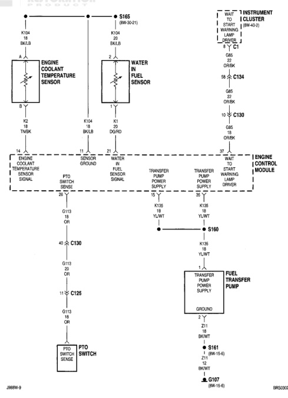

# 8W-30-20

## BW-30 FUEL/IGNITION SYSTEM

*Fig. 1 Fig. JBBW-9 and BRS03093 - Engine Coolant Temperature, Water in Fuel Sensor, and Fuel Transfer Pump Wiring Diagram*
- S165 (8W-30-21)
- ENGINE COOLANT TEMPERATURE SENSOR
  - Connector: K2 (18 TN/BK)
- WATER IN FUEL SENSOR
  - Connector: K1 (20 DG/RD)
- INSTRUMENT CLUSTER (8W-40-2)
  - WAIT TO START LAMP
  - WATER IN FUEL LAMP
  - Connectors: C134, C130
- ENGINE CONTROL MODULE
  - ENGINE COOLANT TEMPERATURE SENSOR
  - PTO SWITCH SENSE
  - WATER FUEL SENSOR GROUND
  - TRANSFER PUMP POWER SUPPLY
  - TRANSFER PUMP POWER SUPPLY
  - START WARNING DRIVER
- PTO SENSOR (G113)
- PTO SWITCH (C125)
- TRANSFER PUMP POWER SUPPLY
- FUEL TRANSFER PUMP
  - Connectors: S161 (8W-15-6), G107 (8W-15-6)
- S160