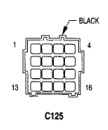

# 8W-80 CONNECTOR PIN-OUTS

## ACCELERATOR PEDAL POSITION SENSOR

*Fig. 7 Accelerator Pedal Position Sensor Connector*

| CAV | CIRCUIT | FUNCTION |
|-----|---------|----------|
| 1 | K104 18BK/LB | SENSOR GROUND |
| 2 | H105 18LG/DB | IDLE VALVE SWITCH NO. 2 |
| 3 | H102 18LB/BK | ACCELERATOR PEDAL POSITION SENSOR SIGNAL |
| 4 | H103 18BK/YL | ACCELERATOR PEDAL POSITION SENSOR GROUND |
| 5 | H101 18DB/WT | ACCELERATOR PEDAL POSITION SENSOR SUPPLY |
| 6 | H104 18BR/OR | IDLE VALVE SWITCH NO. 1 |

## C125

[Figure: C125 Connector - BLACK]

| CAV | CIRCUIT |
|-----|----------|
| 1 | G7 18WT/OR |
| 2 | T6 18OR/WT |
| 3 | T18 18LG/OR |
| 4 | T41 20BK/WT |
| 5 | C22 18DB |
| 6 | K22 18OR/DB |
| 7 | C13 18DB/OR |
| 8 | K24 18GY/BK |
| 9 | V40 18WT/PK |
| 10 | C90 18LG/WT |
| 11 | G113 18OR |
| 12 | K118 18PK/YL |
| 13 | K4 20BK/LB |
| 14 | K51 18DB/YL |
| 15 | T16 18RD |
| 16 | K30 18PK |

[Figure: C125 Connector - BLACK]

| CAV | CIRCUIT |
|-----|----------|
| 1 | G7 20WT/OR |
| 2 | T6 20OR/WT |
| 3 | T18 20LG/OR |
| 4 | T41 20BK/WT |
| 5 | C22 20DB |
| 6 | K22 20OR/DB |
| 7 | C13 20DB/OR |
| 8 | K24 20GY/BK |
| 9 | V40 20WT/PK |
| 10 | C90 20LG/WT |
| 11 | G113 20OR |
| 12 | K118 20PK/YL |
| 13 | K4 20BK/LB |
| 14 | K51 20DB/YL |
| 15 | T16 20RD |
| 16 | K30 20PK |

*M/T
**A/T