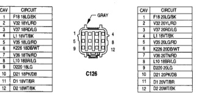
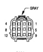
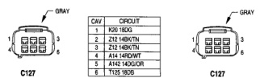

# 8W-80 CONNECTOR PIN-OUTS (continued)

## C126

*Fig. 2 C126 Connector - GRAY*

| CAV | CIRCUIT |
|-----|----------|
| 1 | F18 18LG/BK |
| 2 | V25 18YL/RD |
| 3 | V37 18BK/LG |
| 4 | V38 18RD/LG |
| 5 | V35 18LG/RD |
| 6 | K226 18DB/WT |
| 7 | K227 18BK/LG |
| 8 | L10 18RD/LG |
| 9 | D028 18LG |
| 10 | D21 18YL/BR |
| 11 | D1 18WT/BR |
| 12 | M2 18WT/OR |

*Fig. 3 C126 Connector - GRAY*

| CAV | CIRCUIT |
|-----|----------|
| 1 | F18 20LG/BK |
| 2 | V25 20YL/RD |
| 3 | V37 20RD/LG |
| 4 | V38 20RD/LG |
| 5 | V25 20LG/RD |
| 6 | K226 20DB/WT |
| 7 | K227 20BK/LG |
| 8 | L10 18RD/LG |
| 9 | D020 20LG |
| 10 | D21 20PK/DB |
| 11 | D1 20WT/BR |
| 12 | M2 20WT/OR |

## C127

*Fig. 5 C127 Connector - GRAY*

| CAV | CIRCUIT |
|-----|----------|
| 1 | K20 18DG |
| 2 | Z12 14BK/TN |
| 3 | Z12 14BK/TN |
| 4 | A14 16RD/WT |
| 5 | A142 14DG/OR |
| 6 | T125 18DB |

[Figure: C127 Connector - GRAY]

| CAV | CIRCUIT |
|-----|----------|
| 1 | K20 18DG |
| 2 | Z12 14BK/TN |
| 3 | Z12 14BK/TN |
| 4 | A14 16RD/WT |
| 5 | A142 14DG/OR |
| 6 | T125 18DB |