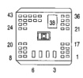

# 8W-80 CONNECTOR PIN-OUTS

*Fig. 2 Connector diagrams showing C130 and C130 (IN PDC) pin layouts with numbered pin positions*

| CAV | CIRCUIT |
|-----|----------|
| 1 | - |
| 2 | - |
| 3 | - |
| 4 | - |
| 5 | A14 12RD/WT |
| 6 | A93 12RD/BK |
| 7 | K24 20GY/BK |
| 8 | K22 20OR/DB |
| 9 | K131 18BR/WT |
| 10 | GB5 18OR/BK |
| 11 | - |
| 12 | - |
| 13 | D1 18VT/BR |
| 14 | - |
| 15 | - |
| 16 | D20 18LG |
| 17 | D2 18WT/BK |
| 18 | K20 18DG |
| 19 | C90 18LG |
| 20 | D21 18PK |
| 21 | C3 18DB/BK |
| 22 | - |
| 23 | - |
| 24 | - |
| 25 | Z12 14BK/TN |
| 26 | A40 14RD/WT |
| 27 | - |
| 28 | F18 18LG/BK |
| 29 | - |
| 30 | - |
| 31 | - |
| 32 | C22 20DB |
| 33 | - |
| 34 | - |
| 35 | T125 18DB |
| 36 | S21 18YL/BK |
| 37 | S22 18OR/BK |
| 38 | - |
| 39 | Z11 18BK/WT |
| 40 | G113 18OR |
| 41 | Z12 14BK/TN |
| 42 | Z12 14BK/TN |
| 43 | Z12 14BK/TN |

**C130**

| CAV | CIRCUIT |
|-----|----------|
| 1 | V35 20LG/RD |
| 2 | V32 20YL/RD |
| 3 | A14 16RD/WT |
| 4 | A142 14DG/OR |
| 5 | A14 12RD/WT |
| 6 | A93 12RD/YL |
| 7 | K24 20GY/BK |
| 8 | K22 20OR/DB |
| 9 | K131 20BR/WT |
| 10 | GB5 22OR/BK |
| 11 | V40 22WT/PK |
| 12 | L10 18BR/LG |
| 13 | D1 20VT/BR |
| 14 | K51 20DB/YL |
| 15 | C13 22DG/OR |
| 16 | D20 20DG |
| 17 | D2 20WT/BK |
| 18 | K20 18DG |
| 19 | C90 20LG/WT |
| 20 | D21 20PK/DB |
| 21 | C3 22DB/BK |
| 22 | V37 22RD/LG |
| 23 | K226 20DB/WT |
| 24 | V36 20TN/RD |
| 25 | - |
| 26 | Z12 14BK/TN |
| 27 | A40 14RD/LG |
| 28 | K31 20BR/WT |
| 29 | F18 20LG/BK |
| 30 | K30 22PK |
| 31 | T18 22LG/OR |
| 32 | T16 22RD |
| 33 | C55 20DB |
| 34 | G7 20WT/OR |
| 35 | T6 22OR/WT |
| 36 | T125 18DB |
| 37 | S21 18YL/BK |
| 38 | S22 18OR/BK |
| 39 | A18 18RD/BK |
| 40 | Z12 18BK/TN |
| 41 | G113 20OR |
| 42 | Z12 14BK/TN |
| 43 | Z12 14BK/TN |
| 44 | Z12 18BK/TN |

**C130 (IN PDC)**