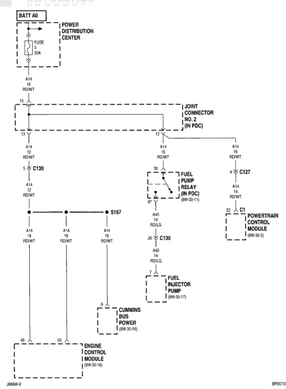

# 8W-10 POWER DISTRIBUTION (continued)

*Fig. 1 8W-10 Power Distribution Wiring Diagram*
- BATT 40: Battery connection with fuse and power distribution center
- C130: Connector
- C127: Connector
- S167: Splice
- C130: Connector
- Fuel Pump Relay (8W-30-11)
- Powertrain Control Module (8W-30-2)
- Fuel Injector Pump (8W-30-17)
- Cummins Bus Power (8W-32-15)
- Engine Control Module (8W-30-16)
- Joint Connector No. 2 (in PDC)
- Wire colors and gauges shown throughout (e.g., 10 RD/WT, 16 RD/WT, 14 RD/WT)
- Ground connections (A14, A40)
- Reference: BR5011002