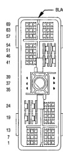

# 8W-80 CONNECTOR PIN-OUTS (continued)

*Fig. 1 Connector diagram showing C134 pin layout with numbered pin positions*

| CAV | CIRCUIT |
|-----|----------|
| 1 | D21 20PK/DB |
| 2 | D220 20WT/VT |
| 3 | - |
| 4 | - |
| 5 | - |
| 6 | - |
| 7 | - |
| 8 | Z12 18BK/TN |
| 9 | Z12 20BK/TN |
| 10 | D2 20WT/BK |
| 11 | D1 20VT/BR |
| 12 | D2 20WT/BK |
| 13 | D20 20LG |
| 14 | D21 20PK/DB |
| 15 | D1 20VT/BR |
| 16 | D2 20WT/BK |
| 17 | D1 20VT/BR |
| 18 | L7 16BK/YL |
| 19 | - |
| 20 | A12 16RD/TN |
| 21 | T6 22OR/WT |
| 22 | L39 22LB |
| 23 | F15 20DB |
| 24 | A3 12RD/YL |
| 25 | F32 16PK/DB |
| 26 | K4 22BK/LB |
| 27 | L35 22BR/YL |
| 28 | - |
| 29 | V37 22RD/LG |
| 30 | G11 22WT/LG |
| 31 | Z9 16BK/VT |
| 32 | X3 22BK/RD |
| 33 | - |
| 34 | Z5 18BK/DB |
| 35 | L3 16RD/OR |
| 36 | L4 16VT/WT |
| 37 | V4 16RD/YL |
| 38 | V49 16RD/BK |
| 39 | V3 16BR/WT |
| 40 | V5 16DG |
| 41 | Z2 18BK/LG |
| 42 | Z6 18BK/PK |
| 43 | C90 22LG/WT |
| 44 | A1 10RD |
| 45 | C1 12DG |
| 46 | - |
| 47 | G50 22RD/DB |
| 48 | V30 22DB/RD |
| 49 | - |
| 50 | A2 14PK/BK |
| 51 | A41 14YL |
| 52 | - |
| 53 | V32 22YL/RD |

**C134**

| CAV | CIRCUIT |
|-----|----------|
| 1 | D21 20PK/DB |
| 2 | D220 20WT/VT |
| 3 | - |
| 4 | - |
| 5 | - |
| 6 | - |
| 7 | - |
| 8 | Z12 14BK/TN |
| 9 | Z12 18BK/TN |
| 10 | D2 20WT/BK |
| 11 | D1 20VT/BR |
| 12 | D2 20WT/BK |
| 13 | D20 20DG |
| 14 | D21 20PK/DB |
| 15 | D1 20VT/BR |
| 16 | D2 20WT/BK |
| 17 | D1 20VT/BR |
| 18 | L7 20BK/YL |
| 19 | - |
| 20 | A12 16RD/TN |
| 21 | T6 22OR/WT |
| 22 | T6 20OR/WT |
| 23 | L39 20LB |
| 24 | F15 22DB |
| 25 | A3 12RD/YL |
| 26 | F32 16PK/DB |
| 27 | K4 22BK/LB |
| 28 | L35 22BR/YL |
| 29 | V37 22RD/LG |
| 30 | V37 20RD/LG |
| 31 | G11 20WT/LG |
| 32 | Z9 16BK/VT |
| 33 | X3 22BK/RD |
| 34 | Z5 18BK/DB |
| 35 | L3 16RD/OR |
| 36 | L4 16VT/WT |
| 37 | V4 16RD/YL |
| 38 | V49 16RD/BK |
| 39 | V3 16BR/WT |
| 40 | V5 16DG |
| 41 | Z2 16BK/LG |
| 42 | Z6 18BK/PK |
| 43 | C90 22LG/WT |
| 44 | C80 20LG/WT |
| 45 | A1 10RD |
| 46 | C1 12DG |
| 47 | G50 22RD/DB |
| 48 | V30 20DB/RD |
| 49 | - |
| 50 | A2 14PK/BK |
| 51 | A41 14YL |
| 52 | V32 20YL/RD |
| 53 | V32 20YL/RD |

**C134**

**CONTINUED**

*DIESEL