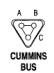

# 8W-80 CONNECTOR PIN-OUTS (continued)

## C134

| CAV | CIRCUIT |
|-----|----------|
| 54 | V18 22YL/DG |
| 55 | V40 22WT/PK |
| 56 | L62 16BR/RD |
| 58 | G85 22DR/BK |
| 59 | G107 22BK/GY |
| 60 | T18 22LG/OR |
| 61 | G29 22BK/WT |
| 62 | G34 16RD/GY |
| 63 | L63 16DG/RD |
| 64 | L50 18WT/TN |
| 65 | F12 20DB/WT |
| 66 | L10 18BR/LG |
| 67 | Z3 18BK/OR |
| 68 | V10 16BR |
| 69 | - |
| 70 | - |
| 71 | - |
| 72 | - |
| 73 | - |
| 74 | - |

## C134 (CONTINUED)

| CAV | CIRCUIT |
|-----|----------|
| 54 | V18 22YL/DG |
| 55 | V40 22WT/PK |
| 56 | L62 16BR/RD |
| 58 | G85 22DR/BK |
| 59 | G107 20GY |
| 60 | T18 20LG/OR |
| 61 | G29 18BK/WT |
| 62 | G34 20RD/GY |
| 63 | L63 16DG/RD |
| 64 | L50 18WT/TN |
| 65 | F12 20DB/WT |
| 66 | L10 18BR/LG |
| 67 | Z3 18BK/OR |
| 68 | V10 16BR |
| 69 | - |
| 70 | - |
| 71 | - |
| 72 | - |
| 73 | - |
| 74 | - |

*Fig. 2 CUMMINS BUS connector diagram showing pins A, B, C*

| CAV | CIRCUIT | FUNCTION |
|-----|---------|----------|
| A | K244 20YL | CUMMINS BUS (+) |
| B | K246 20LG | CUMMINS BUS (-) |
| C | - | - |

*Fig. 3 CUMMINS BUS POWER connector diagram showing pins A, B*

| CAV | CIRCUIT | FUNCTION |
|-----|---------|----------|
| A | A14 18RD/WT | FUSED (B+) |
| B | Z11 18BK/WT | GROUND |