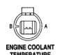

# 8W-80 CONNECTOR PIN-OUTS

*Fig. 2 Engine Coolant Temperature Sensor connector diagram showing 2-pin connector with pins A and B*

**ENGINE COOLANT TEMPERATURE SENSOR**

| CAV | CIRCUIT | FUNCTION |
|-----|---------|----------|
| A | K104 18BK/LB | SENSOR GROUND |
| B | K2 18TN/BK | ENGINE COOLANT TEMPERATURE SENSOR SIGNAL |

[Figure: Engine Oil Pressure Sensor connector diagram showing 3-pin connector with pins C, B, and A]

**ENGINE OIL PRESSURE SENSOR**

| CAV | CIRCUIT | FUNCTION |
|-----|---------|----------|
| A | K7 18OR | 5 VOLT SUPPLY |
| B | K104 18BK/LB | SENSOR GROUND |
| C | G80 18GY/BK | ENGINE OIL PRESSURE SENSOR SIGNAL |

[Figure: Engine Position Sensor connector diagram showing 3-pin connector with pins C, B, and A]

**ENGINE POSITION SENSOR**

| CAV | CIRCUIT | FUNCTION |
|-----|---------|----------|
| A | K7 18OR | 5 VOLT SUPPLY |
| B | K104 18BK/LB | SENSOR GROUND |
| C | K46 18TN/YL | CAMSHAFT POSITION SENSOR SIGNAL |