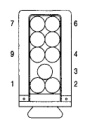

# 8W-80 CONNECTOR PIN-OUTS (continued)

*Fig. 3 Engine Speed Sensor connector diagram showing 3-pin connector with pins C, B, and A*

**ENGINE SPEED SENSOR**

| CAV | CIRCUIT | FUNCTION |
|-----|---------|----------|
| A | K6 18VT/WT | 5 VOLT SUPPLY |
| B | K14 18BK/DB | SENSOR GROUND |
| C | K124 18GY | CRANKSHAFT POSITION SENSOR SIGNAL |

[Figure: Fuel Heater connector diagram showing 2-pin connector with pins 1 and 2]

**FUEL HEATER**

| CAV | CIRCUIT | FUNCTION |
|-----|---------|----------|
| 1 | A53 12RD/BK | FUEL HEATER RELAY OUTPUT |
| 2 | Z11 14BK/WT | GROUND |

[Figure: Fuel Injector Pump connector diagram showing 9-pin connector with pins numbered 1-9]

**FUEL INJECTOR PUMP**

| CAV | CIRCUIT | FUNCTION |
|-----|---------|----------|
| 1 | K240 20LG/PK | DATALINK (-) FUEL INJECTOR PUMP |
| 2 | K242 20YL/PK | DATALINK (+) FUEL INJECTOR PUMP |
| 3 | - | - |
| 4 | K44 18VT/OR | CAMSHAFT POSITION SENSOR SIGNAL |
| 5 | K45 18LB/RD | KNOCK SENSOR RETURN |
| 6 | Z12 14BK/TN | GROUND |
| 7 | A40 14RD/WT | FUEL PUMP RELAY OUTPUT |
| 8 | K48 18DG | FAULT SIGNAL |
| 9 | - | - |

[Figure: Fuel Transfer Pump connector diagram showing 2-pin connector with pins 1 and 2]

**FUEL TRANSFER PUMP**

| CAV | CIRCUIT | FUNCTION |
|-----|---------|----------|
| 1 | K135 18YL/WT | TRANSFER PUMP POWER SUPPLY |
| 2 | Z11 18BK/WT | GROUND |