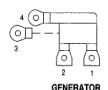
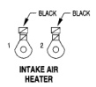

# 8W-80 CONNECTOR PIN-OUTS

*Fig. 2 Generator connector diagram*
- 1: Terminal 1
- 2: Terminal 2
- 3: Terminal 3
- 4: Terminal 4

**GENERATOR**

| CAV | CIRCUIT | FUNCTION |
|-----|---------|----------|
| 1 | K20 18DG | GENERATOR FIELD DRIVER |
| 2 | T125 18DB | GENERATOR FIELD B(+) |
| 3 | A11 4BK | GENERATOR OUTPUT |
| 4 | Z1 18BK | GROUND |

*Fig. 3 Intake air heater connector diagram*
- BLACK: Terminal connection
- BLACK: Terminal connection

**INTAKE AIR HEATER**

| CAV | CIRCUIT | FUNCTION |
|-----|---------|----------|
| 1 | A58 18BK | FUSED B(+) |
| 2 | A122 18BK | FUSED B(+) |