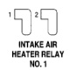
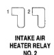
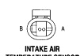

# 8W-80 CONNECTOR PIN-OUTS (continued)

*Fig. 2 Intake air heater relay No. 1 connector diagram*
- 1: Terminal 1
- 2: Terminal 2

**INTAKE AIR HEATER RELAY NO. 1**

| CAV | CIRCUIT | FUNCTION |
|-----|---------|----------|
| 1 | Z12 18BK/TN | GROUND |
| 2 | S21 18YL/BK | AIR INTAKE HEATER RELAY NO. 1 CONTROL |

*Fig. 3 Intake air heater relay No. 2 connector diagram*
- 1: Terminal 1
- 2: Terminal 2

**INTAKE AIR HEATER RELAY NO. 2**

| CAV | CIRCUIT | FUNCTION |
|-----|---------|----------|
| 1 | Z12 18BK/TN | GROUND |
| 2 | S22 18OR/BK | AIR INTAKE HEATER RELAY NO. 2 CONTROL |

*Fig. 4 Intake air temperature sensor connector diagram*
- B: Terminal B
- A: Terminal A

**INTAKE AIR TEMPERATURE SENSOR**

| CAV | CIRCUIT | FUNCTION |
|-----|---------|----------|
| A | K10A 18BK/LB | SENSOR GROUND |
| B | K21 18BK/RD | INTAKE AIR TEMPERATURE SIGNAL |