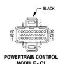

# 8W-80 CONNECTOR PIN-OUTS

*Fig. 4 MANIFOLD ABSOLUTE PRESSURE SENSOR - 3-pin connector diagram*

**MANIFOLD ABSOLUTE PRESSURE SENSOR**

| CAV | CIRCUIT | FUNCTION |
|-----|---------|----------|
| A | K7 18OR | 5 VOLT SUPPLY |
| B | K104 18BK/LB | SENSOR GROUND |
| C | G12 18GY/RD | CHECK GAUGES LAMP DRIVER |

[Figure: POWERTRAIN CONTROL MODULE - C1 - 32-pin connector diagram with BLACK label]

**POWERTRAIN CONTROL MODULE - C1**

| CAV | CIRCUIT | FUNCTION |
|-----|---------|----------|
| 1 | - | - |
| 2 | F18 18LG/BK | FUSED IGN. (ST-RUN) |
| 3 | - | - |
| 4 | K4 18BK/LB | SENSOR GROUND |
| 5 | - | - |
| 6 | T41 18BK/WT | PARK/NEUTRAL POSITION SWITCH SENSE |
| 7 | - | - |
| 8 | K24 18GY/BK | ENGINE SPEED SENSOR SIGNAL |
| 9 | - | - |
| 10 | - | - |
| 11 | - | - |
| 12 | - | - |
| 13 | - | - |
| 14 | - | - |
| 15 | - | - |
| 16 | - | - |
| 17 | - | - |
| 18 | - | - |
| 19 | - | - |
| 20 | - | - |
| 21 | - | - |
| 22 | A14 14RD/WT | FUSED B(+) |
| 23 | K22 18OR/DB | THROTTLE POSITION SENSOR SIGNAL |
| 24 | - | - |
| 25 | - | - |
| 26 | - | - |
| 27 | K1 18DG/RD | WATER IN-FUEL SENSOR SIGNAL |
| 28 | - | - |
| 29 | - | - |
| 30 | Z12 14BK/TN | GROUND |
| 31 | Z12 14BK/TN | GROUND |
| 32 | Z12 14BK/TN | GROUND |