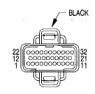

# 8W-80 CONNECTOR PIN-OUTS (continued)

*Fig. 2 POWERTRAIN CONTROL MODULE - C2 - 32-pin connector diagram with BLACK label*

**POWERTRAIN CONTROL MODULE - C2**

| CAV | CIRCUIT | FUNCTION |
|-----|---------|----------|
| 1 | T54 18VT | TRANSMISSION TEMPERATURE SENSOR SIGNAL |
| 2 | - | - |
| 3 | - | - |
| 4 | - | - |
| 5 | - | - |
| 6 | - | - |
| 7 | - | - |
| 8 | K88 18VT/WT | TRANSMISSION VARIABLE FORCE SOLENOID |
| 9 | - | - |
| 10 | K20 18DG | GENERATOR FIELD DRIVER |
| 11 | K54 18OR/BK | TORQUE CONVERTER CLUTCH SOLENOID/RELAY CONTROL |
| 12 | - | - |
| 13 | - | - |
| 14 | - | - |
| 15 | - | - |
| 16 | - | - |
| 17 | - | - |
| 18 | - | - |
| 19 | - | - |
| 20 | - | - |
| 21 | T60 18BR | OVERDRIVE SOLENOID CONTROL |
| 22 | - | - |
| 23 | - | - |
| 24 | - | - |
| 25 | T13 18DB/BK | OUTPUT SHAFT SPEED SENSOR GROUND |
| 26 | - | - |
| 27 | G7 18WT/OR | VEHICLE SPEED SENSOR SIGNAL |
| 28 | T14 18LG/BK | OUTPUT SHAFT SPEED SENSOR SIGNAL |
| 29 | T25 18LG/WT | GOVERNOR PRESSURE SIGNAL |
| 30 | K30 18PK | TRANSMISSION RELAY CONTROL |
| 31 | K7 18OR | 5 VOLT SUPPLY |
| 32 | - | - |