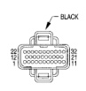
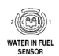

## 8W-80 CONNECTOR PIN-OUTS

### POWERTRAIN CONTROL MODULE - C3

*Fig. 3 Powertrain Control Module C3 connector diagram showing 32-pin connector layout*

| CAV | CIRCUIT | FUNCTION |
|-----|---------|----------|
| 1 | C13 18DB/OR | A/C COMPRESSOR CLUTCH RELAY CONTROL |
| 2 | K51 20DB/YL | AUTO SHUTDOWN RELAY CONTROL |
| 3 | V36 18TN/RD | SPEED CONTROL VACUUM SOLENOID CONTROL |
| 4 | V35 18LG/RD | SPEED CONTROL VENT SOLENOID CONTROL |
| 5 | T18 18LG/OR | OVERDRIVE LAMP DRIVER |
| 6 | - | - |
| 7 | - | - |
| 8 | - | - |
| 9 | - | - |
| 10 | - | - |
| 11 | V32 18TN/RD | SPEED CONTROL ON/OFF SWITCH SENSE |
| 12 | A142 14DG/OR | AUTOMATIC SHUT DOWN RELAY OUTPUT |
| 13 | T6 18OR/WT | TRANSMISSION O/D SWITCH SENSE |
| 14 | - | - |
| 15 | K118 18PK/YL | BATTERY TEMPERATURE SENSOR SIGNAL |
| 16 | - | - |
| 17 | - | - |
| 18 | - | - |
| 19 | - | - |
| 20 | - | - |
| 21 | - | - |
| 22 | C20 18BR | AC SWITCH SENSE |
| 23 | C90 18LG/WT | AC SELECT INPUT |
| 24 | V40 18WT/PK | BRAKE SWITCH SENSE |
| 25 | T125 18DB | GENERATOR OUTPUT |
| 26 | K226 18DB/WT | FUEL LEVEL SENSOR |
| 27 | D21 18PK/DB | SCI TRANSMIT |
| 28 | D2 18WT/BK | CCD BUS (-) |
| 29 | D220 18DG | SCI RECEIVE |
| 30 | D1 18WT/BR | CCD BUS (+) |
| 31 | - | - |
| 32 | V37 18RD/LG | SPEED CONTROL SWITCH SIGNAL |

### WATER IN FUEL SENSOR

*Fig. 4 Water in Fuel Sensor connector diagram showing 2-pin connector layout*

| CAV | CIRCUIT | FUNCTION |
|-----|---------|----------|
| 1 | K1 20DG/RD | WATER IN FUEL SENSOR SIGNAL |
| 2 | K104 20BK/LB | SENSOR GROUND |