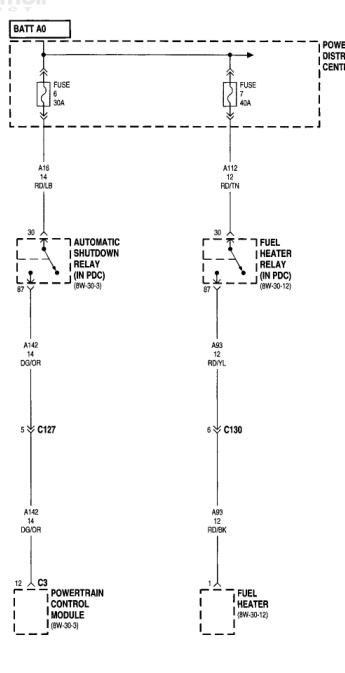

# 8W-10 POWER DISTRIBUTION

## 8W-10-3

*Fig. 1 Fig. 8W-10-3 Power Distribution Wiring Diagram*
- BATT 40: Battery connection with fuses (FUSE 3 30A, FUSE 1 60A)
- POWER DISTRIBUTION CENTER: Main distribution point
- A14 14 RD/LB: Wire to automatic shutdown relay
- A93 12 RD/YL: Wire to fuel heater relay
- AUTOMATIC SHUTDOWN RELAY (IN PDC) (8W-30-3): Relay component
- FUEL HEATER RELAY (IN PDC) (8W-30-12): Relay component
- C127: Connector point
- C130: Connector point
- A14C 14 DG/OR: Wire from relay to door
- A93 12 RD/BK: Wire from relay to heater
- C3 POWERTRAIN CONTROL MODULE (8W-30-5): PCM connection point
- FUEL HEATER (8W-30-12): Fuel heater component

BR5010003

JR8W-9