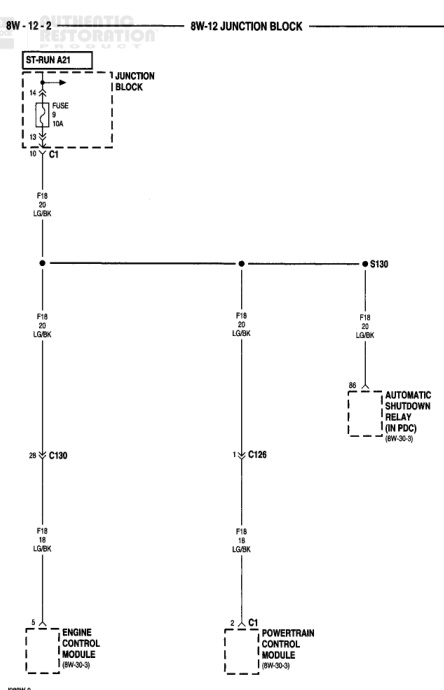

# 8W-12 JUNCTION BLOCK (continued)

*Fig. 1 Fig. 8W-12-2 Junction Block Wiring Diagram*
- ST/RUN A21: Fuse 10A connection to junction block
- C1: Connection point
- P38 LG/BK: Light Green/Black wire
- S130: Splice point
- P38 LG/BK: Multiple light green/black wire connections
- P38 PK LG/BK: Pink light green/black wire
- B6: Connection to Automatic Shutdown Relay (in PDC) 8W-30-3
- 20 C130: Connection point 20 to C130
- 1 C126: Connection point 1 to C126
- P18 LG/BK: Light green/black wire connections
- 2: Connection to Engine Control Module 8W-30-3
- 2 C1: Connection to Powertrain Control Module 8W-30-3

J588W-9

BR501202