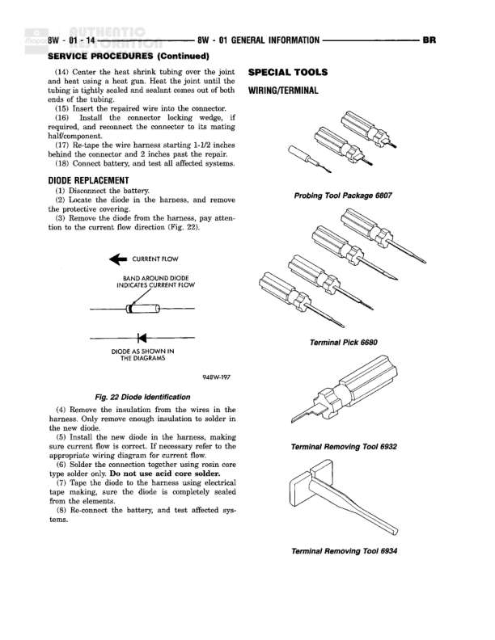

# DIAGNOSTICS AND TESTING (Continued) - General Information

**Notes:** This page contains diagnostic procedures and wiring repair instructions, not a wiring diagram. Content includes: (1) Diagnostic procedures for turning on power, testing voltage drop, and verifying operation; (2) Service procedures for wiring repair including proper wire splicing and soldering techniques; (3) Troubleshooting procedures with 5-step process for identifying and repairing wiring problems. Includes illustrations for voltage drop testing (Fig. 8) and wire repair techniques (Fig. 9) showing three examples of proper wire splicing methods. Page reference: 8W-01-10 from BR (Basic) service manual section.
