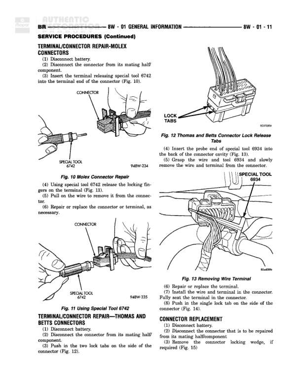

# SERVICE PROCEDURES (Continued) - Connector and Terminal Replacement

**Notes:** This page contains service procedures for connector and terminal replacement, including illustrations for single lock tab (Fig. 14), terminal removal (Fig. 16), connector locking wedge (Fig. 15), and terminal removal using special tool (Fig. 17). Detailed step-by-step instructions are provided for connector and terminal replacement procedures, including cutting wire, removing insulation, soldering connections, and testing affected systems. Special tools referenced include kit 6684 and 94BW-236, 94BW-237.
