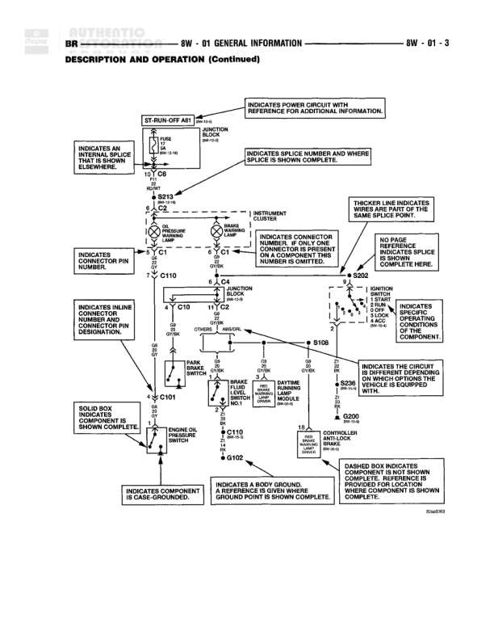

# GENERAL INFORMATION - DESCRIPTION AND OPERATION (Continued)

**Notes:** This is an instructional diagram showing wiring diagram conventions and symbols. It demonstrates power flow from top to bottom, continuation arrows, circuit identification, connector labeling, and various component representations. Internal component descriptions indicate circuit function. Component names also serve as reference connector finding aids.

## Components

| Component | Ref | Connectors | Notes |
|-----------|-----|------------|-------|
| ST-RUN-OFF ART | 8W-01-2 | C1, C2 | Shows start-run-off positions with OFF at top, RUN in middle, START at bottom |
| ST-RUN ART | 8W-01-2 | C5 | Shows run-start positions |
| INSTRUMENT CLUSTER | 8W-01-2 | C1 | Warning lamps location |
| MINI RELAY | 8W-01-2 | C4 | Junction box location |
| MINI RELAY (REAR WIPER/WASHER) | 8W-01-2 |  | Shown with coil and contacts |
| MESSAGE CENTER CONTROL MODULE | 8W-01-2 | C110 | Multiple lamps shown |
| WARNING LAMP (RED) | 8W-01-2 |  | Part of message center |
| WARNING LAMP (YELLOW) | 8W-01-2 |  | Part of message center |
| COOLANT CONTROL LAMP | 8W-01-2 |  | Part of message center |
| WARNING LAMP | 8W-01-2 |  | Part of message center |
| RESISTOR | 8W-01-2 |  | Shown with zigzag symbol |
| MOTOR | 8W-01-2 |  | Shown with M in circle |
| WINDSHIELD WASHER PUMP | 8W-01-2 |  | Controller, relay connector shown |
| TRACTION CONTROL BRAKE DRIVER | 8W-01-2 |  | Controller, relay connector shown |
| TRACTION CONTROL BRAKE LAMP | 8W-01-2 |  | Controller, relay connector shown |
| IGNITION SWITCH LAMP | 8W-01-2 |  | Controller, relay connector shown |

## Wires

| From | To | Wire Code | Gauge | Color | Notes |
|------|-----|-----------|-------|-------|-------|
| ST-RUN-OFF ART connector C1 | External connection | A2 | 14 | RD/WT | OFF position |
| ST-RUN-OFF ART connector C2 | S202 | A2 | 14 | RD/WT | RUN position |
| ST-RUN-OFF ART | External connection | Z1 | 20 | BK/LB | START position |
| ST-RUN ART connector C5 | S200 | Z2 | 20 | BK/WT | RUN contact |
| ST-RUN ART | External connection | Z2 | 20 | BK/WT | START contact |
| S202 | INSTRUMENT CLUSTER C1 | A2 | 14 | RD/WT | None |
| INSTRUMENT CLUSTER C1 | MINI RELAY C4 | A2 | 14 | RD/WT | Junction box |
| MINI RELAY | MINI RELAY (REAR WIPER/WASHER) | A2 | 14 | RD/WT | Relay coil connection |
| MINI RELAY (REAR WIPER/WASHER) | S106 | Z1 | 20 | BK/LB | Relay coil to ground |
| MINI RELAY contacts | S112 | L9 | 20 | LG/WT | NO contact |
| MINI RELAY contacts | External | L10 | 20 | LG/OR | COM contact |
| MESSAGE CENTER C110 | WARNING LAMP (RED) | G84 | 20 | WT/PK | None |
| MESSAGE CENTER C110 | WARNING LAMP (YELLOW) | G85 | 20 | WT/LG | None |
| MESSAGE CENTER C110 | COOLANT CONTROL LAMP | G87 | 20 | WT/BL | None |
| MESSAGE CENTER C110 | WARNING LAMP | G86 | 20 | WT/TN | None |
| WINDSHIELD WASHER PUMP | External | 18 | None | DB/WT | Controller, relay connector |
| TRACTION CONTROL BRAKE DRIVER | External | 19 | None | WT/DG | Controller, relay connector |
| TRACTION CONTROL BRAKE LAMP | External | 20 | None | TN/WT | Controller, relay connector |
| IGNITION SWITCH LAMP | External | 34 | None | LG/OR | Controller, relay connector |

## Splices & Grounds

| ID | Type | Location | Wires Connected | Notes |
|----|------|----------|-----------------|-------|
| S202 | splice | Between ST-RUN-OFF ART and INSTRUMENT CLUSTER | A2 | RD/WT 14 gauge splice |
| S200 | splice | Connected to ST-RUN ART | Z2 | BK/WT 20 gauge splice |
| S106 | splice | Below MINI RELAY | Z1 | BK/LB 20 gauge splice, connects to ground |
| S112 | splice | Below MINI RELAY contacts | L9 | LG/WT 20 gauge splice |
| G300 | ground | Bottom of diagram |  | Ground connection for S106 |
