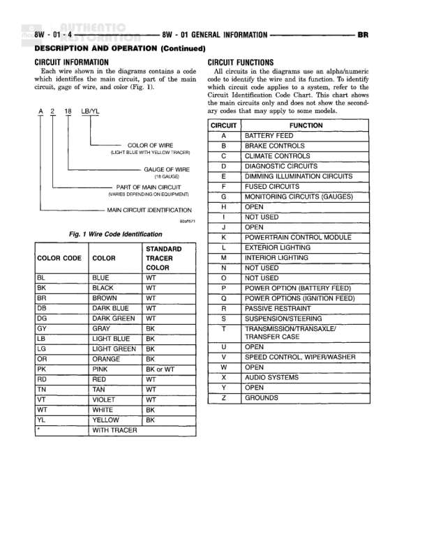

# DESCRIPTION AND OPERATION (Continued) - General Information

**Notes:** This is a legend/symbol explanation diagram showing various wiring diagram conventions including: power circuits, splice indicators, connector numbering, inline connectors, component grounding, body grounds, and circuit identification. The diagram uses these symbols to illustrate brake warning system circuits. Dashed boxes indicate components not shown complete with references provided for location.

## Components

| Component | Ref | Connectors | Notes |
|-----------|-----|------------|-------|
| Junction Block | 8W-01-3 |  | ST-RUN-OFF-ACCY position shown |
| Instrument Cluster | shown on diagram | C1 | Contains warning indicators |
| Low Pressure Warning Indicator | instrument cluster | C1 | Warning indicator light |
| ABS Warning Indicator | instrument cluster | C1 | Warning indicator light |
| Brake Fluid Level Switch | shown on diagram | C101 | Monitors brake fluid level |
| Parking Brake Switch | shown on diagram |  | Detects parking brake application |
| Proportioning Valve Switch | shown on diagram |  | Monitors brake pressure |
| Controller/Anti-Lock Brake Module | shown on diagram |  | ABS control module |

## Wires

| From | To | Wire Code | Gauge | Color | Notes |
|------|-----|-----------|-------|-------|-------|
| Junction Block ST-RUN-OFF-ACCY | Internal Splice | None | 18 | OR | Fuse 16 |
| Internal Splice | C1 (Low Pressure Warning Indicator) | C2 | None | None | Part of same splice point |
| Internal Splice | C1 (ABS Warning Indicator) | C1 | None | None | Part of same splice point |
| C1 (Low Pressure Warning Indicator) | C110 | None | 20 | LG | None |
| C1 (ABS Warning Indicator) | LT C10 | B | None | None | None |
| C110 | LT C10 | None | 20 | LG | None |
| LT C10 | LT C2 | B | None | None | None |
| LT C10 | S502 | C4 | 20 | LG | Junction Block, Instr Panel |
| S502 | S108 | None | None | None | 4-way splice shown complete |
| LT C2 | Stop Lamp Switch | None | None | None | None |
| S108 | Brake Fluid Level Switch | None | 20 | LG | None |
| S108 | Proportioning Valve Switch | None | 20 | LG | None |
| S108 | Parking Brake Switch | None | 20 | LG | None |
| S108 | Controller/Anti-Lock Brake Module | None | 20 | LG | None |
| Brake Fluid Level Switch | C101 | None | 20 | DB/OR | None |
| C101 | Parking Brake Lever Switch | None | 20 | DB/OR | None |
| Parking Brake Lever Switch | C110 | None | 20 | DB/OR | None |
| Parking Brake Lever Switch | G102 | None | 20 | BK/WT | None |
| Controller/Anti-Lock Brake Module | G200 | None | 12 | BK/WT | None |

## Splices & Grounds

| ID | Type | Location | Wires Connected | Notes |
|----|------|----------|-----------------|-------|
| S502 | splice | Junction Block, Instr Panel | C4 | 4-way splice, operating on different circuits but from same current limiter |
| S108 | splice | shown on diagram | LG wires | 4-way splice distributing to brake switches |
| G102 | ground | shown on diagram |  | Body ground for parking brake switch |
| G200 | ground | shown on diagram |  | Ground for ABS Controller |
| Internal Splice | splice | shown in diagram | C1, C2 | Indicates an internal splice that is shown elsewhere |
